# vlyulin_microservices
vlyulin microservices repository

#Content:
* [Student](#Student)
* [Module hw12-docker-2](#Module-hw12-docker-2)
* [Module hw13-docker-3](#Module-hw13-docker-3)
* [Module hw14-docker-4](#Module-hw14-docker-4)
* [Module gitlab-ci-1](#Module-gitlab-ci-1)
* [Module monitoring-1](#Module-monitoring-1)

# Student
`
Student: Vadim Lyulin
Course: DevOps
Group: Otus-DevOps-2021-08
`

## Module hw12-docker-2" Запуск VM с установленным Docker Engine при помощи Docker Machine. Написание Dockerfile и сборка образа с тестовым приложением. Сохранение образа на DockerHub. <a name="Module-hw12-docker-2"></a>
> Цель: В данном дз студент продолжит работать с Docker, создаст образы приложения и загрузит из в DockerHub.
> В данном задании тренируются навыки: работы с Docker, DockerHub.

1. Создана ветка docker-2
2. Создана директория dockermonolith
3. Установлен Docker и проверен с помощью контейнера hello-world
4. Установлен и настроен Yandex Cloud CLI
5. Установлен docker-machine
https://github.com/docker/machine/releases
```
$ curl -L https://github.com/docker/machine/releases/download/v0.16.2/docker-machine-`uname -s`-`uname -m` >/tmp/docker-machine &&
    chmod +x /tmp/docker-machine &&
    sudo cp /tmp/docker-machine /usr/local/bin/docker-machine
```
6. Создан Docker хост в Yandex Cloud
```
yc compute instance create \
  --name docker-host \
  --zone ru-central1-a \
  --network-interface subnet-name=default-ru-central1-a,nat-ip-version=ipv4 \
  --create-boot-disk image-folder-id=standard-images,image-family=ubuntu-1804-lts,size=15 \
  --ssh-key ~/.ssh/id_rsa.pub

docker-machine create \
  --driver generic \
  --generic-ip-address=<ПУБЛИЧНЫЙ_IP_СОЗДАНОГО_ВЫШЕ_ИНСТАНСА> \
  --generic-ssh-user yc-user \
  --generic-ssh-key ~/.ssh/id_rsa \
  docker-host
  
eval $(docker-machine env docker-host)
```
7. Проверка, что docker-host успешно создан
```
docker-machine ls
```
вывод
```
NAME          ACTIVE   DRIVER    STATE     URL                        SWARM   DOCKER      ERRORS
docker-host   *        generic   Running   tcp://51.250.13.185:2376           v20.10.11
```

8. PID namespace (изоляция процессов)

Сравнение запуска docker с и без совместного использования process namespace для host машины.
Команда:
```
docker run --rm -ti tehbilly/htop
```
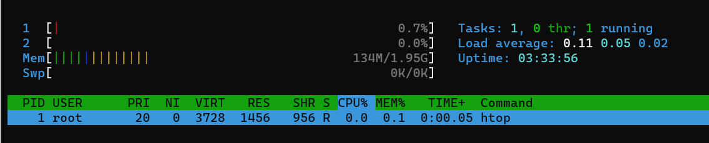
Команда:
```
docker run --rm --pid host -ti tehbilly/htop
```
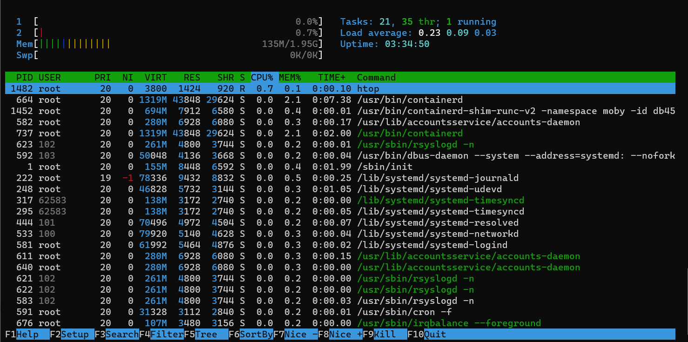

Вывод: при использованиии параметра --pid host для контейнера становятся видны все процессы host-машины.

9. net namespace (изоляция сети)
```
--network=host
```
If you use the host network mode for a container, that container’s network stack is not isolated from the Docker host 
(the container shares the host’s networking namespace), and the container does not get its own IP-address allocated. 
For instance, if you run a container which binds to port 80 and you use host networking, the container’s application 
is available on port 80 on the host’s IP address.

10. user namespaces (изоляция пользователей)
```
--userns=host
```
To disable user namespaces for a specific container, add the --userns=host flag to the docker container create, 
docker container run, or docker container exec command.
https://docs.docker.com/engine/security/userns-remap/

11. Созданы файлы db_config Dockerfile mongod.conf start.sh 
12. Собран image reddit
```
docker build -t reddit:latest .
```
13. Запущен контейнер
```
docker run --name reddit -d --network=host reddit:latest
```
14. Проверка результата
```
docker-machine ls
```
вывод:
```
NAME          ACTIVE   DRIVER    STATE     URL                        SWARM   DOCKER      ERRORS
docker-host   *        generic   Running   tcp://51.250.13.185:2376           v20.10.11
```

15. Выполнена регистрация на Docker hub
16. Выполнена аутентификация на Docker Hub
```
docker login
```
вывод
```
Login Succeeded
```

17. Загружен образ reddit на docker hub
```
docker tag reddit:latest vlyulin/otus-reddit:1.0
docker push vlyulin/otus-reddit:1.0 
```
18. Проверен запуск загруженного в Docker hub образа в локальном docker
```
docker run --name reddit -d -p 9292:9292 vlyulin/otus-reddit:1.0
```
19. Просмотр логов контейнера
```
docker logs reddit -f
```
20. Команда интерактивного запуска bash в контейнере
```
docker exec -it reddit bash
```
вывод
```
root@docker-host:/# ps aux
USER       PID %CPU %MEM    VSZ   RSS TTY      STAT START   TIME COMMAND
root         1  0.0  0.1  18032  2772 ?        Ss   18:59   0:00 /bin/bash /start.sh
root        10  0.3  1.7 391396 36640 ?        Sl   18:59   0:13 /usr/bin/mongod --fork --logpath /var/log/mongod.log --
root        21  0.0  1.5 650992 31500 ?        Sl   19:00   0:01 puma 3.10.0 (tcp://0.0.0.0:9292) [reddit]
root        36  0.4  0.1  18244  3224 pts/0    Ss   19:56   0:00 bash
root        51  0.0  0.1  34424  2820 pts/0    R+   19:56   0:00 ps aux
root@docker-host:/#
```
21. Выполнены проверки:
```
docker logs reddit -f
```

```
docker exec -it reddit bash
```


```
docker run --name reddit --rm -it vlyulin/otus-reddit:1.0 bash
ps aux
```
вывод:
```
root@691a1a36b0f9:/# ps aux
USER       PID %CPU %MEM    VSZ   RSS TTY      STAT START   TIME COMMAND
root         1  0.3  0.1  18244  3108 pts/0    Ss   11:25   0:00 bash
root        17  0.0  0.1  34424  2868 pts/0    R+   11:25   0:00 ps aux
root@691a1a36b0f9:/# exit
exit
```

С  помощью  следующих  команд  можно  посмотреть  подробную
информацию  о  образе,  вывести  только  определенный  фрагмент
информации, запустить приложение и добавить/удалить папки и осмотреть
дифф,  проверить  что  после  остановки  и  удаления  контейнера  никаких
изменений не останется:

```
docker inspect vlyulin/otus-reddit:1.0
```
вывод:
```
[
    {
        "Id": "sha256:bf6e64c49aa3c1ff131dc8cc9033f2466d07204388dd2d984629e7b6ae0631ad",
        "RepoTags": [
            "reddit:latest",
            "vlyulin/otus-reddit:1.0"
        ],
        "RepoDigests": [
            "vlyulin/otus-reddit@sha256:caeb05eaac980c7d9a426610507c01468fb2fb1f5bf82d6199d2a7e87b0fbd1d"
        ],
        "Parent": "sha256:52f3a1b5646961d169e540eebbff63e0984fe1ed6f986fc7d60eec6af8888e2e", ...
```

```
docker inspect vlyulin/otus-reddit:1.0 -f '{{.ContainerConfig.Cmd}}'
```
вывод:
```
[/bin/sh -c #(nop)  CMD ["/start.sh"]]
```

```
docker run --name reddit -d -p 9292:9292 vlyulin/otus-reddit:1.0
```
вывод:
```
ae2629db5090a652e04ea819b5238e9c9dfbdf6a24584359e2377d25e9b1fa47
```

```
docker exec -it reddit bash
mkdir /test1234
touch /test1234/testfile
rmdir /opt
docker diff reddit
```
>**_Note_**: docker diff: List the changed files and directories in a containers filesystem since the container was created.

вывод:
```
A /test1234
A /test1234/testfile
C /tmp
A /tmp/mongodb-27017.sock
C /var
C /var/log
A /var/log/mongod.log
C /var/lib
C /var/lib/mongodb
A /var/lib/mongodb/mongod.lock
A /var/lib/mongodb/_tmp
A /var/lib/mongodb/journal
A /var/lib/mongodb/journal/j._0
A /var/lib/mongodb/journal/prealloc.1
A /var/lib/mongodb/journal/prealloc.2
A /var/lib/mongodb/local.0
A /var/lib/mongodb/local.ns
C /root
A /root/.bash_history
D /opt
```

```
docker stop reddit && docker rm reddit
docker run --name reddit --rm -it vlyulin/otus-reddit:1.0 bash
ls /
```
вывод
```
bin   dev  home  lib64  mnt  proc    root  sbin  start.sh  tmp  var
boot  etc  lib   media  opt  reddit  run   srv   sys       usr
```
>**_Note_**: директория opt на месте

### Задание со *
>>>
Когда  есть  готовый  образ  с  приложением,  можно
автоматизировать  поднятие  нескольких  инстансов  в  Yandex  Cloud,
установку на них докера и запуск там образа /otus-reddit:1.0
- Нужно реализовать в виде прототипа в директории /docker-monolith/infra/
- Поднятие инстансов с помощью Terraform, их количество задается переменной;
- Несколько плейбуков Ansible с использованием динамического инвентори для установки докера и запуска там образа приложения;
- Шаблон пакера, который делает образ с уже установленным Docker;
>>>

1. Создана директория docker-monolith\infra\packer 
2. Настроен inventory
Проверена работоспособность yacloud_compute inventory plugin
>**_Note_**: команды выполняются из директории ansible
```
ansible -i environments/stage/yacloud_compute.yml --playbook-dir=./playbooks --list-hosts all
после настройки ansible.cfg
ansible --list-hosts all
```
вывод:
```
  hosts (1):
    docker-host
```
3. Созданы директории ./docker-monolith/infra/packer и ./docker-monolith/infra/ansible
4. Созданы соответствующие файла сборки image в директории /packer. 
Создан файл docker-monolith\infra\ansible\playbooks\install_docker.yml для установки docker в image создаваемый packer.
В файле packer/ubuntu-with-docker.json указано использование install_docker.yml
```
    "provisioners": [
        {
            "type": "ansible",
            "playbook_file": "ansible/playbooks/install_docker.yml"
        }
```
5. Проверен и создан образ
```
packer validate -var-file=./packer/variables.json ./packer/ubuntu-with-docker.json
packer build -var-file=./packer/variables.json ./packer/ubuntu-with-docker.json
```
вывод
```
Build 'yandex' finished after 3 minutes 56 seconds.

==> Wait completed after 3 minutes 56 seconds

==> Builds finished. The artifacts of successful builds are:
--> yandex: A disk image was created: ubuntu-with-docker-1637950974 (id: fd87c49pj8rv80utnbd3) with family name ubuntu-with-docker
```

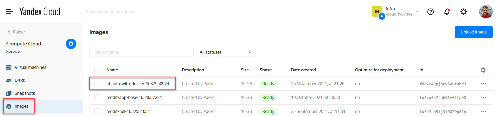

6. Создана директория ./docker-monolith/infra/terraform. 
В файле Main.tf указан созданный packer образ через переменную var.disk_image
```
  boot_disk {
    initialize_params {
      image_id = var.disk_image
    }
  }
```

7. Проинициализирован terraform в дирректории ./terraform
```
init terraform
```
вывод:
```
Initializing the backend...

Initializing provider plugins...
- Checking for available provider plugins...
- Downloading plugin for provider "yandex" (terraform-providers/yandex) 0.56.0...
```

8. Выполнена проверка настроек terraform. Исполняется из директории ./terraform
```
terraform plan
```
вывод
```
An execution plan has been generated and is shown below.
Resource actions are indicated with the following symbols:
  + create

Terraform will perform the following actions:

  # yandex_compute_instance.docker[0] will be created
  + resource "yandex_compute_instance" "docker" {
      + created_at                = (known after apply)
      + folder_id                 = (known after apply)
      + fqdn                      = (known after apply)
      + hostname                  = (known after apply)
      + id                        = (known after apply)
      + labels                    = {
          + "tags" = "docker"
        }
...
```

9. Созданы окружения
```
terraform apply
```
вывод
```
Apply complete! Resources: 2 added, 0 changed, 0 destroyed.

Outputs:

internal_ip_address_app = [
  "10.128.0.16",
  "10.128.0.13",
]
```

10. Создан файл docker-monolith\infra\ansible\playbooks\install-reddit.yml для установки приложения reddit

11. Выполнена установка приложения reddit как контейнеры на окружения в docker.
Выполняется из директории ./infra/ansible
Проверка группы окружений docker.
```
ansible --list-hosts docker
```
вывод
```
  hosts (2):
    docker-1
    docker-0
```
установка
```
ansible-playbook ./playbooks/install-reddit.yml --limit docker
```
12. Проверка работоспособности приложения http://<public_ip>:9292

## Module hw13-docker-3" Разбиение приложения на несколько микросервисов. Выбор базового образа. Подключение volume к контейнеру. <a name="Module-hw13-docker-3"></a>
> Цель: В данном дз студент продолжит работы с Docker, разобьет приложение на отдельные микросервисы, 
> соберет для каждого приложения отдельный образ, выберет базовый образ.
> В данном задании тренируются навыки: создания образов Docker, написания Dockerfile.

1. Подключиться к ранее созданному Docker host’у 
```
docker-machine ls
eval $(docker-machine env docker-host)
```
2. Установлен hadolint
Для ubuntu
```
sudo wget -O /bin/hadolint https://github.com/hadolint/hadolint/releases/download/v1.16.3/hadolint-Linux-x86_64
sudo chmod +x /bin/hadolint
```
Для windows в powershell
```
Set-ExecutionPolicy RemoteSigned -scope CurrentUser
iwr -useb get.scoop.sh | iex
scoop install hadolint
```
3. Скачан и распокован архив reddit-microservices.zip в директорию src
4. Создан файл ./post-py/Dockerfile
5. Создан файл ./comment/Dockerfile
6. Создан файл ./ui/Dockerfile
7. Скачан последний образ mongodb
```
docker pull mongo:latest
```
8. ./posr-py/Docker файл доработан для установки зависимостей requirements.txt. Добавлена команда копирования файла requirements.txt
```
COPY requirements.txt /app/requirements.txt
```
Для исправления следующей ошибки при сборке образа post-py
```
Requested MarkupSafe>=2.0 from https://files.pythonhosted.org/packages/bf/10/ff66fea6d1788c458663a84d88787bae15d45daa16f6b3ef33322a51fc7e/MarkupSafe-2.0.1.tar.gz#sha256=594c67807fb16238b30c44bdf74f36c02cdf22d1c8cda91ef8a0ed8dabf5620a (from Jinja2>=2.4->flask==0.12.3->-r /app/requirements.txt (line 2)), but installing version None
```
в ./post-py/Dockerfile добавлена команда
```
pip install --upgrade pip
```
в результате получилось:
```
RUN pip install --upgrade pip && apk --no-cache --update add build-base && \
    pip install -r /app/requirements.txt && \
    apk del build-base
```
9. Собраны образы с сервисами
```
docker build -t vlyulin/post:1.0 ./post-py
docker build -t vlyulin/comment:1.0 ./comment
docker build -t vlyulin/ui:1.0 ./ui
```
10. Создана сеть и запущено приложение
```
docker network create reddit
docker run -d --network=reddit --network-alias=post_db --network-alias=comment_db mongo:latest
docker run -d --network=reddit --network-alias=post vlyulin/post:1.0
docker run -d --network=reddit --network-alias=comment vlyulin/comment:1.0
docker run -d --network=reddit -p 9292:9292 vlyulin/ui:1.0
```
11. Проверена работоспособность приложения http://<docker-host-ip>:9292/
Где <docker-host-ip> определяется командой
```
docker-machine ls
```
### Задание со *
1. Остановлены контейнеры
```
docker kill $(docker ps -q)
```
2. Запуск контенеров с другими алиасами и передача данных с помощью переменных.
```
docker run -d --network=reddit --network-alias=my_post_db --network-alias=my_comment_db mongo:latest
docker run -d --network=reddit --network-alias=my_post -e POST_DATABASE_HOST=my_post_db vlyulin/post:1.0
docker run -d --network=reddit --network-alias=my_comment -e COMMENT_DATABASE_HOST=my_comment_db vlyulin/comment:1.0
docker run -d --network=reddit -p 9292:9292 -e POST_SERVICE_HOST=my_post -e COMMENT_SERVICE_HOST=my_comment vlyulin/ui:1.0
```
3. docker images
```
ubuntu@vlulinhp:~/vlyulin_microservices/src”$ docker images
REPOSITORY            TAG            IMAGE ID       CREATED        SIZE
vlyulin/ui            1.0            a5a163976c5e   4 hours ago    772MB
```
4. Внесены изменения в src\ui\Dockerfile 
было:
```
FROM ruby:2.2
RUN apt-get update -qq && apt-get install -y build-essential

ENV APP_HOME /app
RUN mkdir $APP_HOME

WORKDIR $APP_HOME
ADD Gemfile* $APP_HOME/
RUN bundle install
ADD . $APP_HOME

ENV POST_SERVICE_HOST post
ENV POST_SERVICE_PORT 5000
ENV COMMENT_SERVICE_HOST comment
ENV COMMENT_SERVICE_PORT 9292

CMD ["puma"]
```
стало:
```
FROM ubuntu:16.04
RUN apt-get update \
    && apt-get install -y ruby-full ruby-dev build-essential \
    && gem install bundler --no-ri --no-rdoc

ENV APP_HOME /app
RUN mkdir $APP_HOME

WORKDIR $APP_HOME
ADD Gemfile* $APP_HOME/
RUN bundle install
ADD . $APP_HOME

ENV POST_SERVICE_HOST post
ENV POST_SERVICE_PORT 5000
ENV COMMENT_SERVICE_HOST comment
ENV COMMENT_SERVICE_PORT 9292

CMD ["puma"]
```
5. Пересобран ui 
```
docker build -t vlyulin/ui:2.0 ./ui
```
6. Проверка размера образа
```
ubuntu@vlulinhp:~/vlyulin_microservices/src”$ docker images
REPOSITORY            TAG            IMAGE ID       CREATED          SIZE
vlyulin/ui            2.0            fcd88a0e7379   20 seconds ago   463MB
vlyulin/ui            1.0            a5a163976c5e   4 hours ago      772MB
```
7. Внесены улучшения по сборке в файле Dockerfile.01 (решение подсмотрено https://github.com/Otus-DevOps-2020-08/Tyatyushkin_microservices)
8. Создан новый образ на основе Alpine Linux
```
docker build -t vlyulin/ui:3.0 ./ui --file ui/Dockerfile.01
```
9. Проверка размера образа
```
ubuntu@vlulinhp:~/vlyulin_microservices/src”$ docker images
REPOSITORY            TAG            IMAGE ID       CREATED         SIZE
vlyulin/ui            3.0            6e21a35b380a   2 minutes ago   206MB
vlyulin/ui            2.0            fcd88a0e7379   9 minutes ago   463MB
vlyulin/ui            1.0            a5a163976c5e   4 hours ago     772MB
```
10. Перезапущены приложения
```
docker kill $(docker ps -q)
docker network create reddit
docker run -d --network=reddit --network-alias=post_db --network-alias=comment_db mongo:latest
docker run -d --network=reddit --network-alias=post vlyulin/post:1.0
docker run -d --network=reddit --network-alias=comment vlyulin/comment:1.0
docker run -d --network=reddit -p 9292:9292 vlyulin/ui:3.0
```
11. Создан Docker volume
```
docker volume create reddit_db
```
12. Docker volume подключен при запуске приложения "-v reddit_db:/data/db"
```
docker kill $(docker ps -q)
docker network create reddit
docker run -d --network=reddit --network-alias=post_db --network-alias=comment_db -v reddit_db:/data/db mongo:latest
docker run -d --network=reddit --network-alias=post vlyulin/post:1.0
docker run -d --network=reddit --network-alias=comment vlyulin/comment:1.0
docker run -d --network=reddit -p 9292:9292 vlyulin/ui:2.0
```
13. Проверка, что посты остаются после перезапуска приложений 
```
docker kill $(docker ps -q)
docker run -d --network=reddit --network-alias=post_db --network-alias=comment_db -v reddit_db:/data/db mongo:latest
docker run -d --network=reddit --network-alias=post vlyulin/post:1.0
docker run -d --network=reddit --network-alias=comment vlyulin/comment:1.0
docker run -d --network=reddit -p 9292:9292 vlyulin/ui:2.0
```

## Module hw14-docker-4 Практика работы с основными типами Docker сетей. Декларативное описание Docker инфраструктуры при помощи Docker Compose. <a name="Module-hw14-docker-4"></a>
> Цель: В данном дз студент продолжит работать с Docker. 
> Узнает типы сетей используемые Docker. Научится создавать и управлять сетями.
> В данном задании тренируются навыки: создания и управления сетями Docker.

### Подключение к ранее созданному docker host'у
```
docker-machine ls
eval $(docker-machine env docker-host)
```

### Сеть None
1. Запуск контейнера с сетью none
```
docker run -ti --rm --network none joffotron/docker-net-tools -c ifconfig
```
вывод
```
Unable to find image 'joffotron/docker-net-tools:latest' locally
latest: Pulling from joffotron/docker-net-tools
3690ec4760f9: Pull complete
0905b79e95dc: Pull complete
Digest: sha256:5752abdc4351a75e9daec681c1a6babfec03b317b273fc56f953592e6218d5b5
Status: Downloaded newer image for joffotron/docker-net-tools:latest
lo        Link encap:Local Loopback
          inet addr:127.0.0.1  Mask:255.0.0.0
          UP LOOPBACK RUNNING  MTU:65536  Metric:1
          RX packets:0 errors:0 dropped:0 overruns:0 frame:0
          TX packets:0 errors:0 dropped:0 overruns:0 carrier:0
          collisions:0 txqueuelen:1000
          RX bytes:0 (0.0 B)  TX bytes:0 (0.0 B)
```

>**_Note_**: внутри контейнера из сетевых интерфейсов существует только loopback.  

### Сеть Host
2. Запуск контейнера с сетью host
```
docker run -ti --rm --network host joffotron/docker-net-tools -c ifconfig
```
вывод
```
br-99f1ba03b46d Link encap:Ethernet  HWaddr 02:42:45:97:9D:F8
          inet addr:172.18.0.1  Bcast:172.18.255.255  Mask:255.255.0.0
          UP BROADCAST MULTICAST  MTU:1500  Metric:1
          RX packets:0 errors:0 dropped:0 overruns:0 frame:0
          TX packets:0 errors:0 dropped:0 overruns:0 carrier:0
          collisions:0 txqueuelen:0
          RX bytes:0 (0.0 B)  TX bytes:0 (0.0 B)

docker0   Link encap:Ethernet  HWaddr 02:42:D6:9E:EB:3F
          inet addr:172.17.0.1  Bcast:172.17.255.255  Mask:255.255.0.0
          UP BROADCAST MULTICAST  MTU:1500  Metric:1
          RX packets:0 errors:0 dropped:0 overruns:0 frame:0
          TX packets:0 errors:0 dropped:0 overruns:0 carrier:0
          collisions:0 txqueuelen:0
          RX bytes:0 (0.0 B)  TX bytes:0 (0.0 B)

eth0      Link encap:Ethernet  HWaddr D0:0D:14:AD:AF:B0
          inet addr:10.128.0.29  Bcast:10.128.0.255  Mask:255.255.255.0
          inet6 addr: fe80::d20d:14ff:fead:afb0%32512/64 Scope:Link
          UP BROADCAST RUNNING MULTICAST  MTU:1500  Metric:1
          RX packets:1618 errors:0 dropped:0 overruns:0 frame:0
          TX packets:1533 errors:0 dropped:0 overruns:0 carrier:0
          collisions:0 txqueuelen:1000
          RX bytes:358742 (350.3 KiB)  TX bytes:158121 (154.4 KiB)

lo        Link encap:Local Loopback
          inet addr:127.0.0.1  Mask:255.0.0.0
          inet6 addr: ::1%32512/128 Scope:Host
          UP LOOPBACK RUNNING  MTU:65536  Metric:1
          RX packets:182 errors:0 dropped:0 overruns:0 frame:0
          TX packets:182 errors:0 dropped:0 overruns:0 carrier:0
          collisions:0 txqueuelen:1000
          RX bytes:14462 (14.1 KiB)  TX bytes:14462 (14.1 KiB)
```

Сравнение с командой 'docker-machine ssh docker-host ifconfig'
```
br-99f1ba03b46d: flags=4099<UP,BROADCAST,MULTICAST>  mtu 1500
        inet 172.18.0.1  netmask 255.255.0.0  broadcast 172.18.255.255
        ether 02:42:45:97:9d:f8  txqueuelen 0  (Ethernet)
        RX packets 0  bytes 0 (0.0 B)
        RX errors 0  dropped 0  overruns 0  frame 0
        TX packets 0  bytes 0 (0.0 B)
        TX errors 0  dropped 0 overruns 0  carrier 0  collisions 0

docker0: flags=4099<UP,BROADCAST,MULTICAST>  mtu 1500
        inet 172.17.0.1  netmask 255.255.0.0  broadcast 172.17.255.255
        ether 02:42:d6:9e:eb:3f  txqueuelen 0  (Ethernet)
        RX packets 0  bytes 0 (0.0 B)
        RX errors 0  dropped 0  overruns 0  frame 0
        TX packets 0  bytes 0 (0.0 B)
        TX errors 0  dropped 0 overruns 0  carrier 0  collisions 0

eth0: flags=4163<UP,BROADCAST,RUNNING,MULTICAST>  mtu 1500
        inet 10.128.0.29  netmask 255.255.255.0  broadcast 10.128.0.255
        inet6 fe80::d20d:14ff:fead:afb0  prefixlen 64  scopeid 0x20<link>
        ether d0:0d:14:ad:af:b0  txqueuelen 1000  (Ethernet)
        RX packets 1530  bytes 346643 (346.6 KB)
        RX errors 0  dropped 0  overruns 0  frame 0
        TX packets 1459  bytes 146763 (146.7 KB)
        TX errors 0  dropped 0 overruns 0  carrier 0  collisions 0

lo: flags=73<UP,LOOPBACK,RUNNING>  mtu 65536
        inet 127.0.0.1  netmask 255.0.0.0
        inet6 ::1  prefixlen 128  scopeid 0x10<host>
        loop  txqueuelen 1000  (Local Loopback)
        RX packets 182  bytes 14462 (14.4 KB)
        RX errors 0  dropped 0  overruns 0  frame 0
        TX packets 182  bytes 14462 (14.4 KB)
        TX errors 0  dropped 0 overruns 0  carrier 0  collisions 0
```

**Вывод: сетевые интерфейсы совпадают**

>**_Note_**: При запуске команды 'docker-machine ssh docker-host ifconfig' получена ошибка:
```
bash: ifconfig: command not found
exit status 127
```
Решение:
a) Получить ip dicker-host
```
docker-machine ip docker-host
```
b) Зайти на docker-host 
```
ssh -i ~/.ssh/id_rsa -l yc-user <docker-host ip>
или проще
docker-machine ssh docker-host
выполнить установку
apt install net-tools
```

3. Запуск нескольких 'docker run --network host -d nginx'
Проверка 
```
docker ps
```
вывод
```
CONTAINER ID   IMAGE                 COMMAND                  CREATED          STATUS          PORTS
                   NAMES
5ae5ec80bcd1   nginx                 "/docker-entrypoint.…"   26 seconds ago   Up 24 seconds
                   nervous_ellis
dff513697905   vlyulin/ui:2.0        "puma"                   6 hours ago      Up 6 hours      0.0.0.0:9292->9292/tcp, :::9292->9292/tcp   tender_newton
c3033ab87bc7   vlyulin/comment:1.0   "puma"                   6 hours ago      Up 6 hours
                   cool_bardeen
505dd76848da   vlyulin/post:1.0      "python3 post_app.py"    6 hours ago      Up 6 hours
                   laughing_greider
d70216d5539d   mongo:latest          "docker-entrypoint.s…"   6 hours ago      Up 6 hours      27017/tcp
                   hopeful_sinoussi
```

Работает только один nginx, так как сеть одна и порт 80 уже занят.
```
docker ps
```
вывод
```
CONTAINER ID   IMAGE                 COMMAND                  CREATED              STATUS                      PORTS                                       NAMES
cd1798fab984   nginx                 "/docker-entrypoint.…"   57 seconds ago       Exited (1) 53 seconds ago
                                   xenodochial_williams
b00b60bbf177   nginx                 "/docker-entrypoint.…"   59 seconds ago       Exited (1) 55 seconds ago
                                   compassionate_boyd
5ae5ec80bcd1   nginx                 "/docker-entrypoint.…"   About a minute ago   Up About a minute
```
Подтверждение:
```
docker logs cd1798fab984
```
вывод
```
/docker-entrypoint.sh: /docker-entrypoint.d/ is not empty, will attempt to perform configuration
/docker-entrypoint.sh: Looking for shell scripts in /docker-entrypoint.d/
/docker-entrypoint.sh: Launching /docker-entrypoint.d/10-listen-on-ipv6-by-default.sh
10-listen-on-ipv6-by-default.sh: info: Getting the checksum of /etc/nginx/conf.d/default.conf
10-listen-on-ipv6-by-default.sh: info: Enabled listen on IPv6 in /etc/nginx/conf.d/default.conf
/docker-entrypoint.sh: Launching /docker-entrypoint.d/20-envsubst-on-templates.sh
/docker-entrypoint.sh: Launching /docker-entrypoint.d/30-tune-worker-processes.sh
/docker-entrypoint.sh: Configuration complete; ready for start up
2021/11/28 18:43:16 [emerg] 1#1: bind() to 0.0.0.0:80 failed (98: Address already in use)
nginx: [emerg] bind() to 0.0.0.0:80 failed (98: Address already in use)
```

*** Docker networks
4. На docker-host машине создана ссылка
```
ssh -i ~/.ssh/id_rsa -l yc-user `docker-machine ip docker-host`
sudo ln -s /var/run/docker/netns /var/run/netns
```
5. Запуск контейнеров с использованием драйверов none и host и проверка изменения списка namespace-ов
*None network*
```
docker run --network none -d nginx - несколько раз
docker ps
```
вывод:
```
effb761e1f43   nginx     "/docker-entrypoint.…"   3 seconds ago    Up 2 seconds              hopeful_aryabhata
74d3ca61e120   nginx     "/docker-entrypoint.…"   13 seconds ago   Up 12 seconds             adoring_northcutt
55f52451df1d   nginx     "/docker-entrypoint.…"   56 seconds ago   Up 55 seconds             gallant_poincare
```
Проверка namespaces
```
docker-machine ssh docker-host sudo ip netns
```
вывод:
```
7c8ad8c82169
a35a48508504
6862ef519d67
default
```

*Host network*
```
docker kill $(docker ps -q)
docker run --network host -d nginx - несколько раз
docker ps
```
вывод
```
CONTAINER ID   IMAGE     COMMAND                  CREATED         STATUS         PORTS     NAMES
019dd436275c   nginx     "/docker-entrypoint.…"   7 seconds ago   Up 6 seconds             agitated_villani
```
Проверка namespaces
```
docker-machine ssh docker-host sudo ip netns
```
вывод
```
default
```
### Bridge network driver
1. Созданы сети
```
docker network create back_net --subnet=10.0.2.0/24
```
2. Запуск проекта reddit в 2-х сетях
```
docker run -d --network=back_net --network-alias=post_db --network-alias=comment_db -v reddit_db:/data/db mongo:latest
docker run -d --network=back_net --network-alias=post vlyulin/post:1.0
docker run -d --network=back_net --network-alias=comment vlyulin/comment:1.0
docker run -d --network=front_net -p 9292:9292 vlyulin/ui:2.0
```
3. Подключение post и comment во вторую сеть
```
-- post
docker network connect front_net 7d1b4b0d8efea2036605f37ffb86f751fb7241e2bb1c433b41ececca646ba197
-- comment
docker network connect front_net c0bf2322a441d8ef43868fd11d96a06f85f1c316480b708f20ef506bcf1cbd3a
```
### docker-compose
1. Установлен docker-compose
```
pip install docker-compose
```
2. Создан файл src\docker-compose.yml 
3. Сборка и запуск
```
export USERNAME=vlyulin
docker-compose up -d 
docker-compose ps
```
вывод
```
ubuntu@vlulinhp:~/vlyulin_microservices/src”$ export USERNAME=vlyulin
ubuntu@vlulinhp:~/vlyulin_microservices/src”$ docker-compose up -d
Creating network "src_reddit" with the default driver
Creating volume "src_post_db" with default driver
Pulling post_db (mongo:3.2)...
3.2: Pulling from library/mongo
a92a4af0fb9c: Pull complete
74a2c7f3849e: Pull complete
927b52ab29bb: Pull complete
e941def14025: Pull complete
be6fce289e32: Pull complete
f6d82baac946: Pull complete
7c1a640b9ded: Pull complete
e8b2fc34c941: Pull complete
1fd822faa46a: Pull complete
61ba5f01559c: Pull complete
db344da27f9a: Pull complete
Digest: sha256:0463a91d8eff189747348c154507afc7aba045baa40e8d58d8a4c798e71001f3
Status: Downloaded newer image for mongo:3.2
Creating src_comment_1 ... done
Creating src_ui_1      ... done
Creating src_post_db_1 ... done
Creating src_post_1    ... done
ubuntu@vlulinhp:~/vlyulin_microservices/src”$ docker-compose ps
    Name                  Command             State                    Ports
----------------------------------------------------------------------------------------------
src_comment_1   puma                          Up
src_post_1      python3 post_app.py           Up
src_post_db_1   docker-entrypoint.sh mongod   Up      27017/tcp
src_ui_1        puma                          Up      0.0.0.0:9292->9292/tcp,:::9292->9292/tcp
```
#### Задание: Изменить docker-compose под кейс с множеством сетей, сетевых алиасов (стр 18).
1. В файле src/docker-compose.yml указываем сети
```
networks:
  front_net:
  back_net:
```
2. Указываем требуемые сети для каждого контейнера. Например:
```
  comment:
    build: ./comment
    image: ${USERNAME}/comment:1.0
    networks:
      - back_net
      - front_net
```
#### Задание: Параметризуйте с помощью переменных окружений: порт публикации сервиса ui, версии сервисов
1. Создан файл .env
```
USERNAME=vlyulin
UI_PORT=80
UI_VER=1.0
POST_VER=1.0
COMMENT_VER=1.0
```
2. .env добавлен в .gitignore. Создан файл .env.example
3. Проверка
```
docker-compose up -d
```
5. Наименования проекта указывается ключом -p
```
docker-compose -p dockermicroservices up -d
```

#### Задание со *
1. Создан файл docker-compose.override.yml
2. Изменение исходного кода без пересборки образов можно выполнять примонтировав в директорию /app подключаемый volume в которую установить новую версию приложения.
Это можно сделать добавив следующий фрагмент в файл docker-compose.override.yml:
```
post:
    volumes:
    - post-py:/app
```
2. Запуск приложения выполняется командой
```
docker-compose up -d
```
Объединение файлов docker-compose.yml и docker-compose.override.yml в одну конфигурацию произойдет автоматически.
Главное, чтобы они были в директории, где выполняется команда.
Если требуется указать путь к файлу, то используется флаг -f.
https://docs.docker.com/compose/reference/

## Module gitlab-ci-1 Gitlab CI. Построение процесса непрерывной интеграции. <a name="Module-gitlab-ci-1"></a>
> Цель: В данном дз студент установит и произведет первичную настройку Gitlab CI. Напишет и настроит первый pipeline.
> В данном задании тренируются навыки: установки и настройки Gitlab CI, написания пайплайнов.
> Цели задания:
> Подготовить инсталляцию Gitlab CI
> Подготовить репозиторий с кодом приложения
> Описать для приложения этапы пайплайна
> Определить окружения

### Создание виртуальной машины для Gitlab CI
1. В директории gitlab-ci\infra\terraform созданы скрипты для создания виртуальной машины.
2. Выполнена проверка скриптов
```
terraform validate
terraform plan
```
3. Выполнено создание виртуальной машины
```
terraform apply -auto-approve=true
```
вывод
```
yandex_compute_instance.gitlab-ci[0]: Creating...
yandex_compute_instance.gitlab-ci[0]: Still creating... [10s elapsed]
yandex_compute_instance.gitlab-ci[0]: Still creating... [20s elapsed]
yandex_compute_instance.gitlab-ci[0]: Creation complete after 22s [id=fhmgjtqtgijjr073jilv]

Apply complete! Resources: 1 added, 0 changed, 0 destroyed.

Outputs:

internal_ip_address_app = [
  "10.128.0.7",
]
```
### Установка Docker
>**_Note**: установка вручную https://docs.docker.com/engine/install/ubuntu/

1. Установлен Docker на созданную виртуальную машину в Yandex Cloud
```
docker-machine create \
  --driver generic \
  --generic-ip-address=51.250.1.180 \
  --generic-ssh-user ubuntu \
  --generic-ssh-key ~/.ssh/ubuntu/ubuntu \
  gitlab-docker-host

eval $(docker-machine env gitlab-docker-host)
```
где 51.250.1.180 - это <ПУБЛИЧНЫЙ_IP_СОЗДАНОГО_ВЫШЕ_ИНСТАНСА>

вывод
```
Running pre-create checks...
Creating machine...
(gitlab-docker-host) Importing SSH key...
Waiting for machine to be running, this may take a few minutes...
Detecting operating system of created instance...
Waiting for SSH to be available...
Detecting the provisioner...
Provisioning with ubuntu(systemd)...
Installing Docker...
Copying certs to the local machine directory...
Copying certs to the remote machine...
Setting Docker configuration on the remote daemon...
Checking connection to Docker...
Docker is up and running!
To see how to connect your Docker Client to the Docker Engine running on this virtual machine, run: docker-machine env gitlab-docker-host
```

2. Проверка, что gitlab-docker-host успешно создан
```
docker-machine ls
```
вывод
```
NAME                 ACTIVE   DRIVER    STATE     URL                       SWARM   DOCKER      ERRORS
docker-host                   generic   Timeout
gitlab-docker-host   -        generic   Running   tcp://51.250.1.180:2376           v20.10.11
```
3. Установлен community.docker.docker_container
```
ansible-galaxy collection install community.docker
```
4. Создан playbook install-gitlab-ci.yml
5. Выполнена установка gitlab-ci
```
ansible-playbook ./playbooks/install-gitlab-ci.yml
```
6. Проверка работоспособности
```
http://51.250.1.180
```
где 51.250.1.180 - <ПУБЛИЧНЫЙ_IP_СОЗДАНОГО_ВЫШЕ_ИНСТАНСА>
В результате видна страница следующего вида
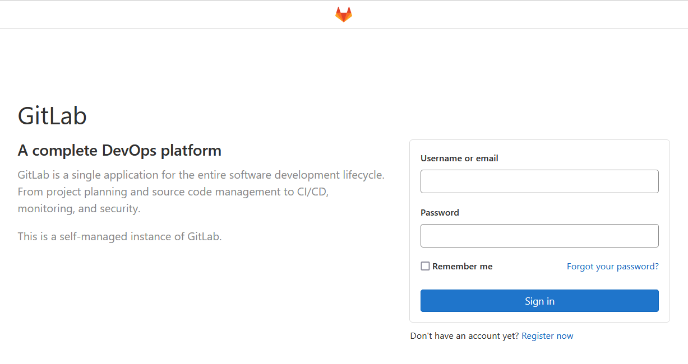

8. Как войти?
Имя пользователя: root
Палоль можно получить зайдя на gitlab-docker-host
```
docker-machine ssh gitlab-docker-host
sudo docker exec -it gitlab grep 'Password:' /etc/gitlab/initial_root_password
```
вывод
```
Password: zG87QzFcL+aXB6Z6L3ZOg...
```
9. В GitLab создана группа homework
10. В группе homework создан проект example
11. Создание отдельной git ветки в репозитории infra и добавления remote репозитория
```
git checkout -b gitlab-ci-1 
git remote add gitlab http://51.250.1.180/homework/example.git
git push gitlab gitlab-ci-1
```
#### Определение CI/CD Pipeline
1. В корне репозитория infra создан файл .gitlab-ci.yml
2. Изменения переданы в репозиторий
```
git add .gitlab-ci.yml
git commit -m "add pipeline definition"
git push gitlab gitlab-ci-1
```
3. Так как нет runner, то pipeline в статусе pending
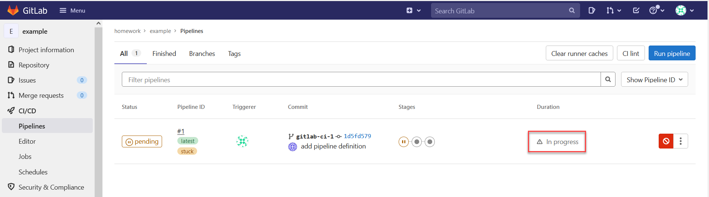

4. Получение токена для регистрации runner.
На странице Gitlab: Settings -> CI/CD -> Pipelines -> Runners скопировать token
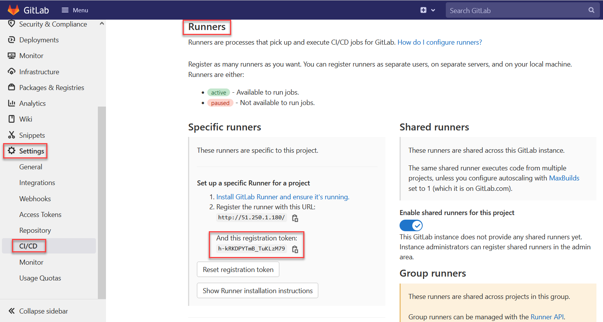

5. На сервере, где работает Gitlab CI - gitlab-docker-host, выполнена команда
```
docker run -d --name gitlab-runner --restart always -v /srv/gitlab-runner/config:/etc/gitlab-runner -v /var/run/docker.sock:/var/run/docker.sock gitlab/gitlab-runner:latest
```
6. Регистрация раннера
```
docker exec -it gitlab-runner gitlab-runner register \ 
    --url http://51.250.1.180 \ 
    --non-interactive \ 
    --locked=false \ 
    --name DockerRunner \ 
    --executor docker \ 
    --docker-image alpine:latest \ 
    --docker-privileged job
    --registration-token h-kRKDPYTmB_TuKLzM79 \
    --tag-list "linux,xenial,ubuntu,docker" \ 
    --run-untagged
```
или
```
docker exec -it gitlab-runner gitlab-runner register --url http://51.250.1.180 --non-interactive --locked=false --name DockerRunner --executor docker --docker-image alpine:latest --docker-privileged job --registration-token h-kRKDPYTmB_TuKLzM79 --tag-list "linux,xenial,ubuntu,docker" --run-untagged
```
7. Проверка пайплайна
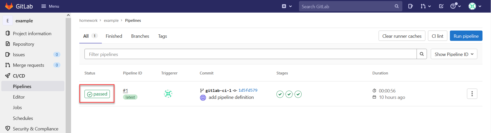

#### Добавлен Reddit
8. Добавлен Reddit в проект
```
git clone https://github.com/express42/reddit.git && rm -rf ./reddit/.git 
git add reddit/ 
git commit -m "Add reddit app" 
git push gitlab gitlab-ci-1
```
9. Внесены изменения в .gitlab-ci.yml 
10. Добавлен файл simpletest.rb
11. Изменения сохранены в GitLab
```
git add .
git commit -m "Add reddit app"
git push gitlab gitlab-ci-1
```
12. Проверка паплайна
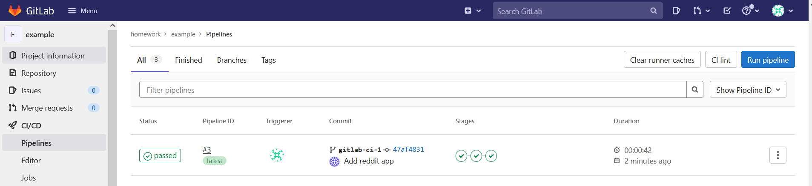
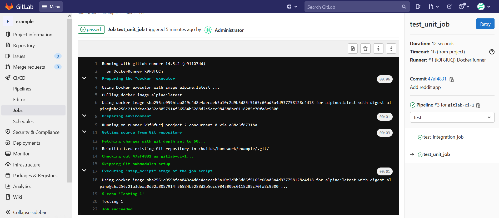

#### Добавление окружения dev
13. В файле .gitlab-ci.yml переименован stage deploy в review и для него добавлено описание окружения dev.
14. Изменения переданы в GitLab
15. Проверено появление окружения dev
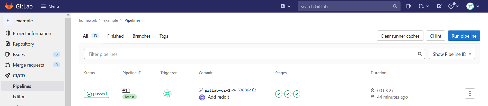

#### Добавление новых окружений
16. В файле .gitlab-ci.yml добавлены два этапа stage и production
17. Pipeline теперь выглядит следующим образом:
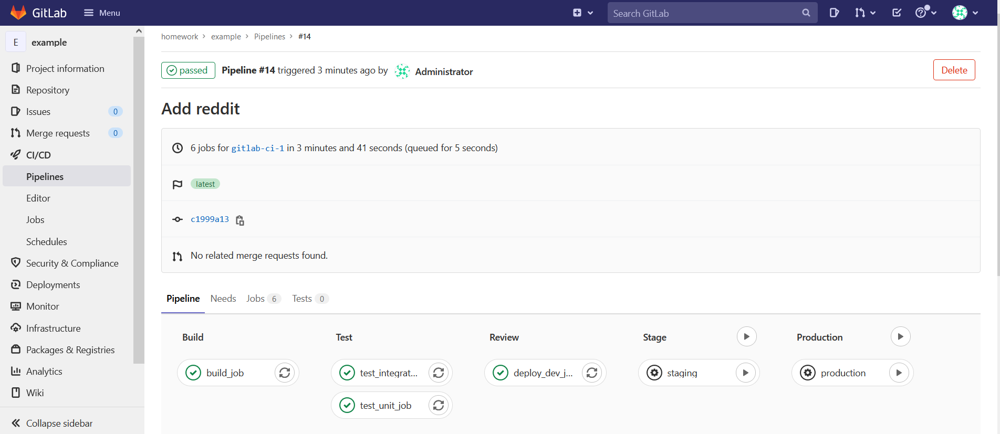
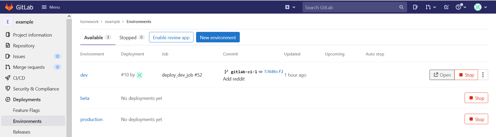

#### Условия и ограничения
18. Добавление проверки tag версии как необходимого условия для выполнения условия запуска job (директива only) к этапам staging и production
19. Изменения переданы в GitLab с указанием tag
```
git commit -am '#4 add logout button to profile page' 
git tag 2.4.10 
git push gitlab gitlab-ci-1 --tags
```
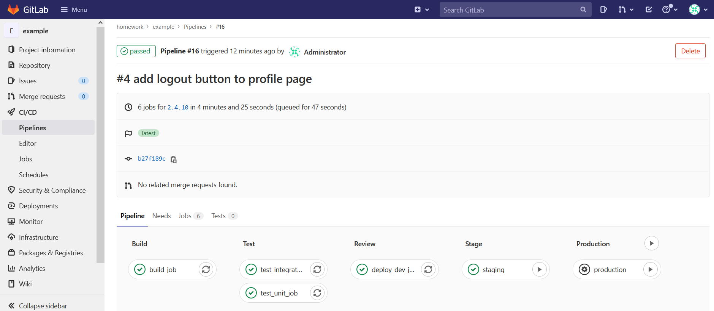
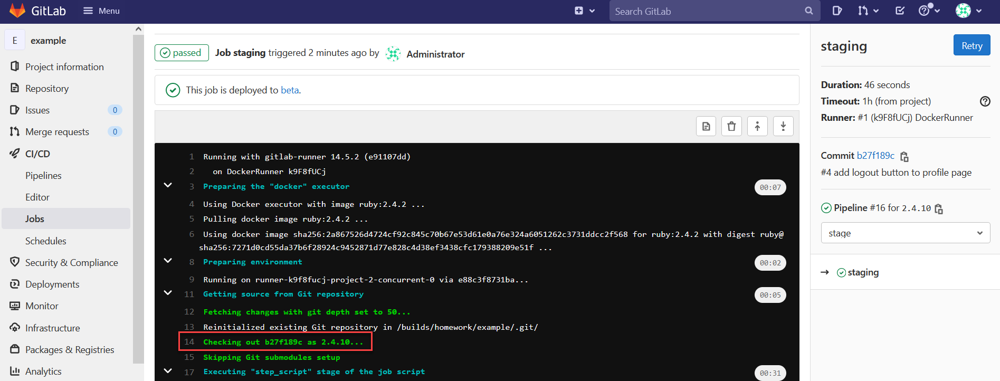

#### Динамические окружения
>**_Note_**: Динамические окружения позволяют иметь выделенный стенд для, например, каждой feature-ветки в git.
20. В файл .gitlab-ci.yml добавлена  ещё  одна  задача branch review, которая определяет  динамическое
окружение для каждой ветки в репозитории, кроме ветки master.
```
branch review: 
  stage: review
  script: echo "Deploy to $CI_ENVIRONMENT_SLUG" 
  environment: 
    name: branch/$CI_COMMIT_REF_NAME 
    url: http://$CI_ENVIRONMENT_SLUG.example.com 
  only: 
    - branches
  except:
    - master
```
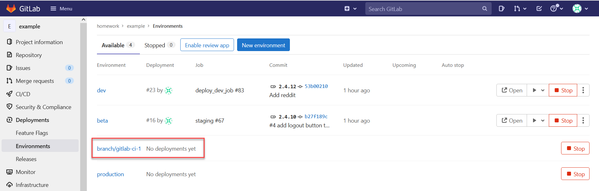

#### 10.1*. Запуск reddit в контейнере (пожеланию)
>**_Note_**: см. .gitlab-ci-with-docker-build.yml

1. Регистрация runner использующего Docker executor
```
docker exec -it gitlab-runner gitlab-runner register -n --url http://51.250.1.180 --name MyDockerRunner --registration-token "h-kRKDPYTmB_TuKLzM79" --executor docker --docker-image "docker:19.03.12" --docker-privileged --docker-volumes "/certs/client"
```
2. Создан Dokerfile
```
FROM ruby:2.4.2

ADD ./reddit /reddit
RUN cd /reddit && ls && bundle install
ENV SERVER_IP=51.250.1.180
ENV REPO_NAME=vlyulin/reddit
ENV DEPLOY_USER=deploy
RUN cd /reddit && ruby simpletest.rb
```
3. Добавлена задача в .gitlab-ci-with-docker-build.yml для формирования image
```
# before_script: 
#  - cd reddit 
#  - bundle install 

build_job:
  stage: build
  image: docker:19.03.12
  variables:
    DOCKER_TLS_CERTDIR: "/certs"
  services:
    - docker:19.03.12-dind
  before_script:
    - docker info
  script:
    - echo 'Building'
    - docker build -t my-reddit-docker-image .
    - docker run my-reddit-docker-image
```
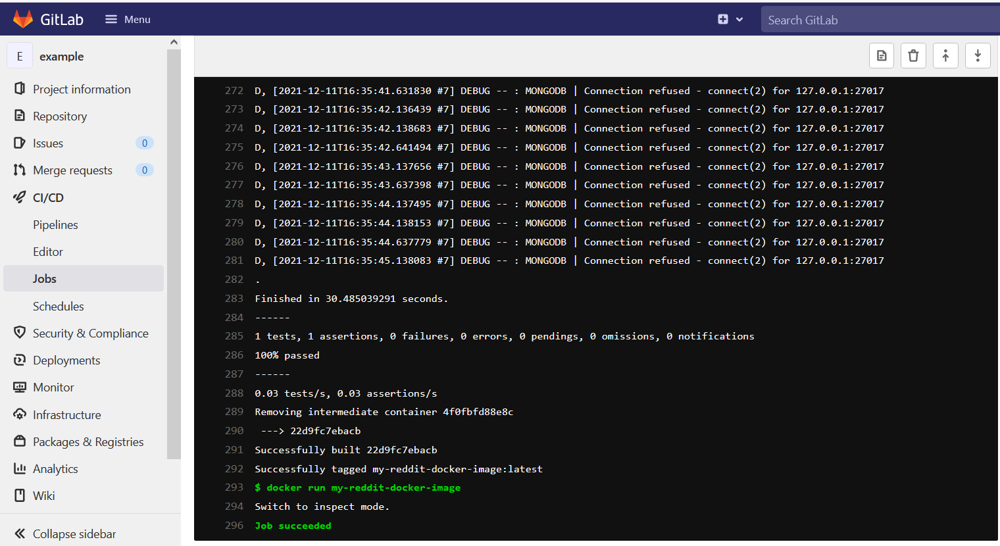

4. Задача для выполнения теста не выполняется, так как не находит созданный image
```
test_unit_job:
  stage: test
  image: my-reddit-docker-image
  script: 
    - docker run my-reddit-docker-image sh -c "ruby simpletest.rb"
```
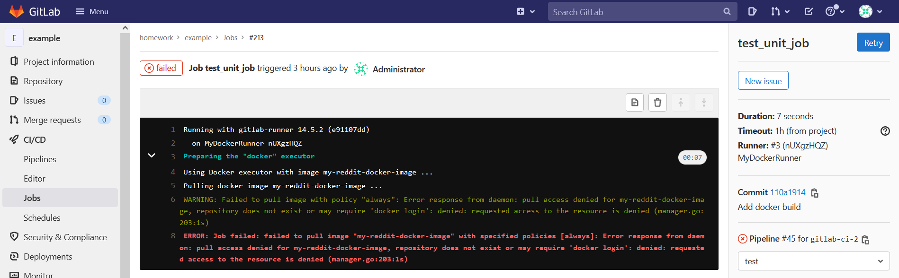

Нужен container registry: Packages & Registries > Container Registry.
А у меня его нет.

Инструкция по установке: https://docs.gitlab.com/ee/administration/packages/container_registry.html
Начал устанавливать, но не получилось.

#### 10.2*. Автоматизация развёртывания GitLabRunner
>**_Note_**: https://docs.ansible.com/ansible/latest/collections/community/general/gitlab_runner_module.html
1. Установка community.general.gitlab_runner для Create, modify and delete GitLab Runners.
```
ansible-galaxy collection install community.general
``` 
2. Создание playbook для установки gitlab_runner (файл gitlab-ci\infra\ansible\playbooks\install-runner.yml)
```
---
- name: install runner
  hosts: all
  become: true
  tasks:
  - name: Install aptitude using apt
    apt: name=python-gitlab state=latest update_cache=yes force_apt_get=yes
  
  - name: Register runner for example project
    gitlab_runner:
      api_url: http://51.250.1.180/
      api_token: "xuL79voqeZoVYyc64fx-"
      registration_token: h-kRKDPYTmB_TuKLzM79
      description: MyProject runner
      state: present
      active: True
      project: homework/example

```
3. Попытка установки
```
ansible-playbook ./playbooks/install-runner.yml
```
Завершается с ошибкой, для котоорой не смог найти решения
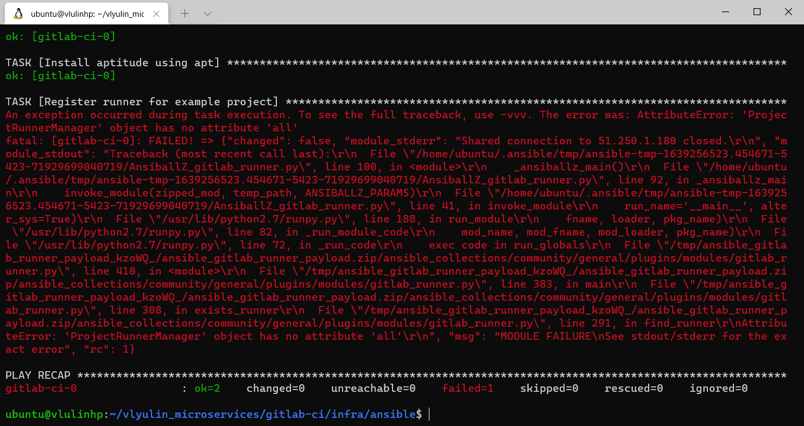

## Module monitoring-1: Создание и запуск системы мониторинга Prometheus. <a name="Module-monitoring-1"></a>
> Цель: В данном дз студент познакомится с инструментов мониторинга Prometheus. Произведет его настройку и настройку exporters.
> В данном задании тренируются навыки: создания системы мониторинга на базе Prometheus.
> Мониторинг состояния микросервисов, сбор метрик при помощи prometheus exporters.

1. Создана ветка monitoring-1
2. Создан Docker хост в Yandex Cloud
```
yc compute instance create \
--name docker-host \
--zone ru-central1-a \
--network-interface subnet-name=default-ru-central1-a,nat-ip-version=ipv4 \
--create-boot-disk image-folder-id=standard-images,image-family=ubuntu-1804-lts,size=15 \
--ssh-key ~/.ssh/id_rsa.pub 
```
3. Инициализировано окружение Docker
```
docker-machine create \
--driver generic \
--generic-ip-address=51.250.13.185 \
--generic-ssh-user yc-user \
--generic-ssh-key ~/.ssh/id_rsa \
docker-host

eval $(docker-machine env docker-host)
```
### Запуск Prometheus
1. Запуск Prometheus в контейнере
```
docker run --rm -p 9090:9090 -d --name prometheus prom/prometheus
```
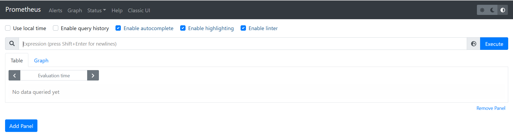

2. В корне репозитория microservices создана директория monitoring 
3. Создана директория monitoring/prometheus
4. Создан файл monitoring/prometheus/Dockerfile
```
FROM prom/prometheus:v2.1.0
ADD prometheus.yml /etc/prometheus/
```
5. Создан файл vlyulin_microservices\monitoring\prometheus\prometheus.yml 
```
---
global:
  scrape_interval: '5s'

scrape_configs:
  - job_name: 'prometheus'
    static_configs:
      - targets:
        - 'localhost:9090'

  - job_name: 'ui'
    static_configs:
      - targets:
        - 'ui:9292'

  - job_name: 'comment'
    static_configs:
      - targets:
        - 'comment:9292'
```
6. В директории prometheus собиран Docker образ
```
export USER_NAME=vlyulin
docker build -t $USER_NAME/prometheus .
```
7. Сборка images для микросервисного приложения
```
/src/ui $ bash docker_build.sh
/src/post-py $ bash docker_build.sh
/src/comment $ bash docker_build.sh
```
Или сразу все из корня репозитория:
```
for i in ui post-py comment; do cd src/$i; bash docker_build.sh; cd -; done
```
8. Создан файл vlyulin_microservices\docker\docker-compose.yml
9. В docker\docker-compose.yml добавлен новый сервис prometheus
10. Запуск сервисов
```
docker-compose up -d
```
#### Мониторинг состояния микросервисов
1. Проверка targets
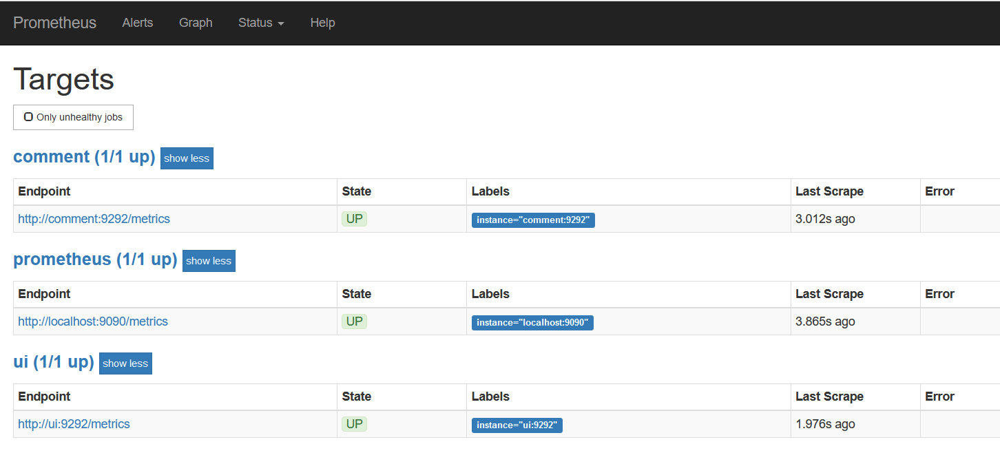

#### Node exporter
1. В \docker\docker-compose.yml добавлен новый сервис node-exporter для сбора информации о работе Docker
хоста (виртуальной машины, где запущены контейнеры) и представлению этой информации в Prometheus.

2. Настроен Prometheus для получения информации еще из одного сервиса. Для этого добавлено описание job_name: 'node' в файл monitoring\prometheus\prometheus.yml 
3. Пересобран новый Docker для Prometheus
```
export USER_NAME=vlyulin
monitoring/prometheus $ docker build -t $USER_NAME/prometheus .
```
4. Пересозданы сервисы
```
docker-compose down
docker-compose up -d
```
5. Получившийся список targets
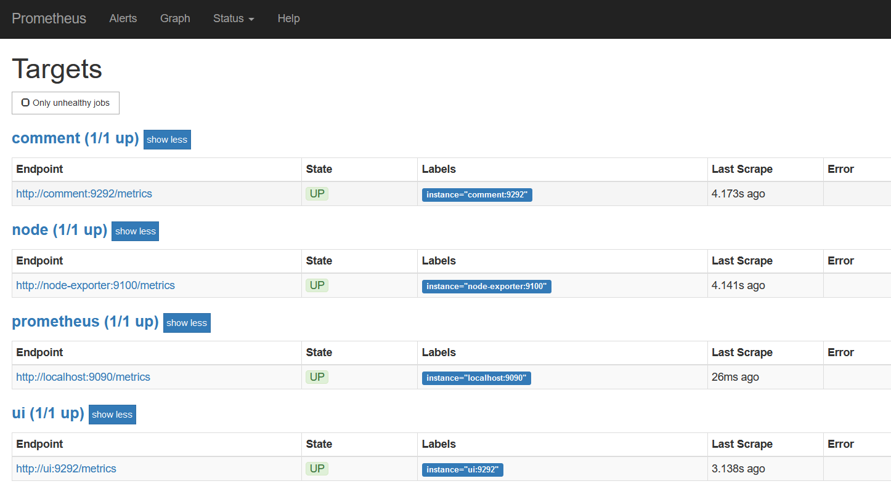

6. Проверка мониторинга
На хост машине выполнить команды:
```
docker-machine ssh docker-host
yes > /dev/null
```
В результате видно увеличение нагрузки
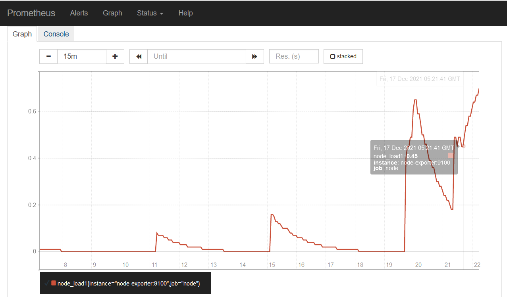

#### Завершение работы
1. Размещение образов на DockerHub
```
docker login
docker push $USER_NAME/ui
docker push $USER_NAME/comment
docker push $USER_NAME/post
docker push $USER_NAME/prometheus
```

Ссылки на образы на docker hub:
```
https://hub.docker.com/repository/docker/vlyulin/ui
https://hub.docker.com/repository/docker/vlyulin/comment
https://hub.docker.com/repository/docker/vlyulin/post
https://hub.docker.com/repository/docker/vlyulin/prometheus
```

2. Удалена ВМ
```
docker-machine rm docker-host
yc compute instance delete docker-host
```

#### Задание со *
> Добавить в Prometheus мониторинг MongoDB с использованием необходимого экспортера.
1. В качестве экспортера выбран https://hub.docker.com/r/percona/mongodb_exporter
2. В docker/docker-compose.yml файл добавлен сервис:
```
  mongodb-exporter:
    image: percona/mongodb_exporter:0.30.0
    command:
      - '--mongodb.uri=mongodb://post_db:27017'
    networks:
      - back_net
```
В файл monitoring\prometheus\prometheus.yml добавлен target:
```
  - job_name: 'mongodb-node-exporter'
    static_configs:
      - targets:
        - 'mongodb-exporter:9216'
```

Targets:
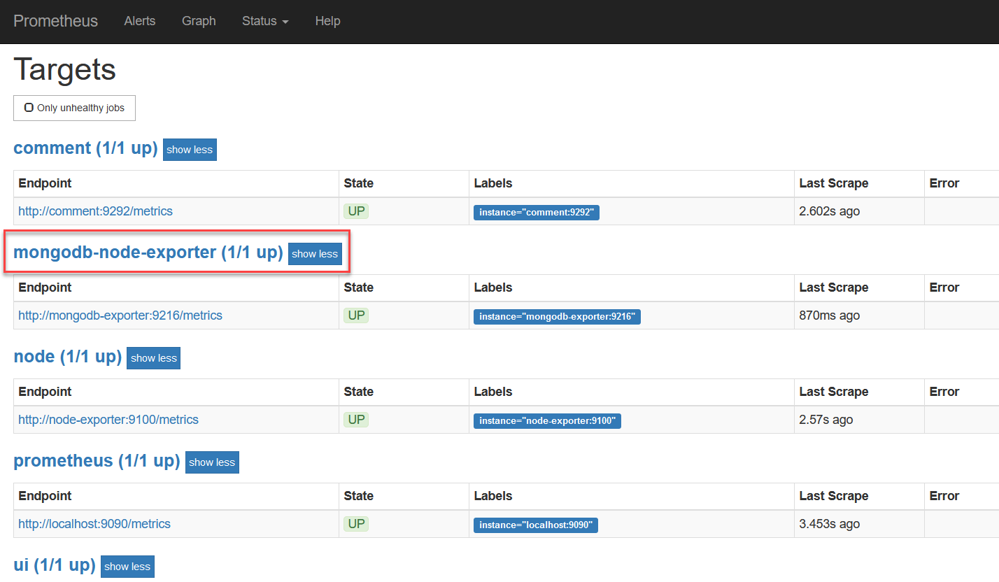

Метрики mongodb:
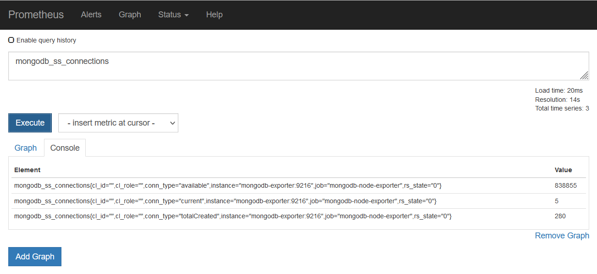

#### Задание со *
> Добавить в Prometheus мониторинг сервисов comment, post, ui с помощью Cloudprober от Google.
1. В директории monitoring\cloudprober создан файл настроек cloudprober.cfg для Cloudprober
2. В директории monitoring\cloudprober создан файл Dockerfile для сборки нового имиджа содержащего образ cloudprober/cloudprober и файл настроек cloudprober.cfg
3. В файл docker\docker-compose.yml добавлен сервис cloudprober
4. В файл monitoring\prometheus\prometheus.yml добавлен target для Cloudprober
5. Собрать образ cloudprober
```
export USER_NAME=vlyulin
docker build -t $$USER_NAME/cloudprober ./monitoring/cloudprober/
```
6. Собрать образ prometheus
```
docker build -t $$USER_NAME/prometheus ./monitoring/prometheus/
```
7. Запуск приложения
```
docker-compose --project-directory ./docker up -d
```
5. Проверка работы Globeprober
```
http://51.250.13.185:9313/status
```
Вывод:


8. Статистика для globeprober в prometheus
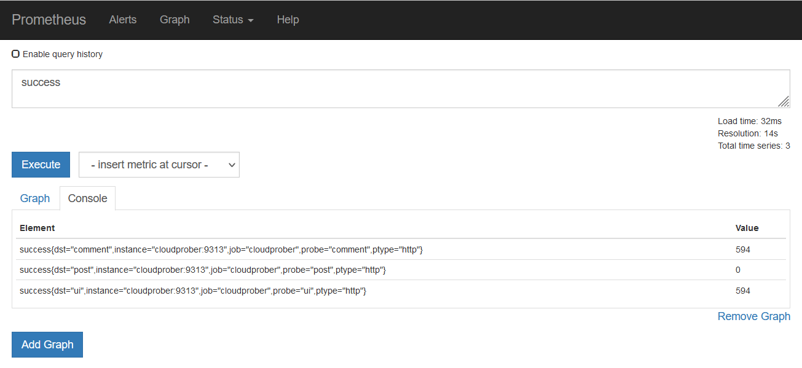


#### Задание со *
> Напиcать Makefile, который в минимальном варианте умеет:
> 1. Билдить любой или все образы, которые сейчас используются
> 2. Умеет пушить их в докер хаб
1. В корне репозитария vlyulin_microservices создан файл Makefile
2. Команды для сбора образов
```
make ui-image
make post-image
make comment-image
make prometheus-image
```
3. Команда сбора всех образов
```
make all
```
4. Каманда отправки образов в DockerHub
```
make push-images
```
5. Команда запуска приложения
```
make up
```
6. Команда остановки приложения 
```
make stop
```
