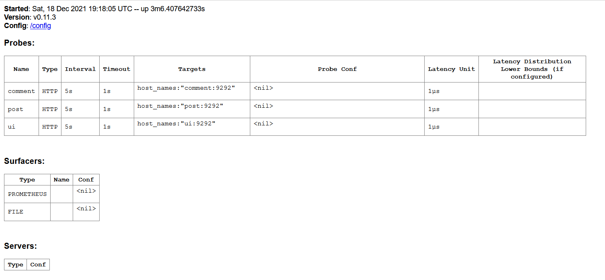

# vlyulin_microservices
vlyulin microservices repository

#Content:
* [Student](#Student)
* [Module hw12-docker-2](#Module-hw12-docker-2)
* [Module hw13-docker-3](#Module-hw13-docker-3)
* [Module hw14-docker-4](#Module-hw14-docker-4)
* [Module gitlab-ci-1](#Module-gitlab-ci-1)
* [Module monitoring-1](#Module-monitoring-1)
* [Module logging-1](#Module-logging-1)
* [Module kubernetes-1](#Module-kubernetes-1)
* [Module kubernetes-2](#Module-kubernetes-2)
* [Module kubernetes-3](#Module-kubernetes-3)
* [Module kubernetes-4](#Module-kubernetes-4)

# Student
`
Student: Vadim Lyulin
Course: DevOps
Group: Otus-DevOps-2021-08
`

## Module hw12-docker-2" Запуск VM с установленным Docker Engine при помощи Docker Machine. Написание Dockerfile и сборка образа с тестовым приложением. Сохранение образа на DockerHub. <a name="Module-hw12-docker-2"></a>
> Цель: В данном дз студент продолжит работать с Docker, создаст образы приложения и загрузит из в DockerHub.
> В данном задании тренируются навыки: работы с Docker, DockerHub.

1. Создана ветка docker-2
2. Создана директория dockermonolith
3. Установлен Docker и проверен с помощью контейнера hello-world
4. Установлен и настроен Yandex Cloud CLI
5. Установлен docker-machine
https://github.com/docker/machine/releases
```
$ curl -L https://github.com/docker/machine/releases/download/v0.16.2/docker-machine-`uname -s`-`uname -m` >/tmp/docker-machine &&
    chmod +x /tmp/docker-machine &&
    sudo cp /tmp/docker-machine /usr/local/bin/docker-machine
```
6. Создан Docker хост в Yandex Cloud
```
yc compute instance create \
  --name docker-host \
  --zone ru-central1-a \
  --network-interface subnet-name=default-ru-central1-a,nat-ip-version=ipv4 \
  --create-boot-disk image-folder-id=standard-images,image-family=ubuntu-1804-lts,size=15 \
  --ssh-key ~/.ssh/id_rsa.pub

docker-machine create \
  --driver generic \
  --generic-ip-address=<ПУБЛИЧНЫЙ_IP_СОЗДАНОГО_ВЫШЕ_ИНСТАНСА> \
  --generic-ssh-user yc-user \
  --generic-ssh-key ~/.ssh/id_rsa \
  docker-host
  
eval $(docker-machine env docker-host)
```
7. Проверка, что docker-host успешно создан
```
docker-machine ls
```
вывод
```
NAME          ACTIVE   DRIVER    STATE     URL                        SWARM   DOCKER      ERRORS
docker-host   *        generic   Running   tcp://51.250.13.185:2376           v20.10.11
```

8. PID namespace (изоляция процессов)

Сравнение запуска docker с и без совместного использования process namespace для host машины.
Команда:
```
docker run --rm -ti tehbilly/htop
```

Команда:
```
docker run --rm --pid host -ti tehbilly/htop
```


Вывод: при использованиии параметра --pid host для контейнера становятся видны все процессы host-машины.

9. net namespace (изоляция сети)
```
--network=host
```
If you use the host network mode for a container, that container’s network stack is not isolated from the Docker host 
(the container shares the host’s networking namespace), and the container does not get its own IP-address allocated. 
For instance, if you run a container which binds to port 80 and you use host networking, the container’s application 
is available on port 80 on the host’s IP address.

10. user namespaces (изоляция пользователей)
```
--userns=host
```
To disable user namespaces for a specific container, add the --userns=host flag to the docker container create, 
docker container run, or docker container exec command.
https://docs.docker.com/engine/security/userns-remap/

11. Созданы файлы db_config Dockerfile mongod.conf start.sh 
12. Собран image reddit
```
docker build -t reddit:latest .
```
13. Запущен контейнер
```
docker run --name reddit -d --network=host reddit:latest
```
14. Проверка результата
```
docker-machine ls
```
вывод:
```
NAME          ACTIVE   DRIVER    STATE     URL                        SWARM   DOCKER      ERRORS
docker-host   *        generic   Running   tcp://51.250.13.185:2376           v20.10.11
```

15. Выполнена регистрация на Docker hub
16. Выполнена аутентификация на Docker Hub
```
docker login
```
вывод
```
Login Succeeded
```

17. Загружен образ reddit на docker hub
```
docker tag reddit:latest vlyulin/otus-reddit:1.0
docker push vlyulin/otus-reddit:1.0 
```
18. Проверен запуск загруженного в Docker hub образа в локальном docker
```
docker run --name reddit -d -p 9292:9292 vlyulin/otus-reddit:1.0
```
19. Просмотр логов контейнера
```
docker logs reddit -f
```
20. Команда интерактивного запуска bash в контейнере
```
docker exec -it reddit bash
```
вывод
```
root@docker-host:/# ps aux
USER       PID %CPU %MEM    VSZ   RSS TTY      STAT START   TIME COMMAND
root         1  0.0  0.1  18032  2772 ?        Ss   18:59   0:00 /bin/bash /start.sh
root        10  0.3  1.7 391396 36640 ?        Sl   18:59   0:13 /usr/bin/mongod --fork --logpath /var/log/mongod.log --
root        21  0.0  1.5 650992 31500 ?        Sl   19:00   0:01 puma 3.10.0 (tcp://0.0.0.0:9292) [reddit]
root        36  0.4  0.1  18244  3224 pts/0    Ss   19:56   0:00 bash
root        51  0.0  0.1  34424  2820 pts/0    R+   19:56   0:00 ps aux
root@docker-host:/#
```
21. Выполнены проверки:
```
docker logs reddit -f
```

```
docker exec -it reddit bash
```


```
docker run --name reddit --rm -it vlyulin/otus-reddit:1.0 bash
ps aux
```
вывод:
```
root@691a1a36b0f9:/# ps aux
USER       PID %CPU %MEM    VSZ   RSS TTY      STAT START   TIME COMMAND
root         1  0.3  0.1  18244  3108 pts/0    Ss   11:25   0:00 bash
root        17  0.0  0.1  34424  2868 pts/0    R+   11:25   0:00 ps aux
root@691a1a36b0f9:/# exit
exit
```

С  помощью  следующих  команд  можно  посмотреть  подробную
информацию  о  образе,  вывести  только  определенный  фрагмент
информации, запустить приложение и добавить/удалить папки и осмотреть
дифф,  проверить  что  после  остановки  и  удаления  контейнера  никаких
изменений не останется:

```
docker inspect vlyulin/otus-reddit:1.0
```
вывод:
```
[
    {
        "Id": "sha256:bf6e64c49aa3c1ff131dc8cc9033f2466d07204388dd2d984629e7b6ae0631ad",
        "RepoTags": [
            "reddit:latest",
            "vlyulin/otus-reddit:1.0"
        ],
        "RepoDigests": [
            "vlyulin/otus-reddit@sha256:caeb05eaac980c7d9a426610507c01468fb2fb1f5bf82d6199d2a7e87b0fbd1d"
        ],
        "Parent": "sha256:52f3a1b5646961d169e540eebbff63e0984fe1ed6f986fc7d60eec6af8888e2e", ...
```

```
docker inspect vlyulin/otus-reddit:1.0 -f '{{.ContainerConfig.Cmd}}'
```
вывод:
```
[/bin/sh -c #(nop)  CMD ["/start.sh"]]
```

```
docker run --name reddit -d -p 9292:9292 vlyulin/otus-reddit:1.0
```
вывод:
```
ae2629db5090a652e04ea819b5238e9c9dfbdf6a24584359e2377d25e9b1fa47
```

```
docker exec -it reddit bash
mkdir /test1234

touch /test1234/testfile
rmdir /opt
docker diff reddit
```
>**_Note_**: docker diff: List the changed files and directories in a containers filesystem since the container was created.

вывод:
```
A /test1234
A /test1234/testfile
C /tmp
A /tmp/mongodb-27017.sock
C /var
C /var/log
A /var/log/mongod.log
C /var/lib
C /var/lib/mongodb
A /var/lib/mongodb/mongod.lock
A /var/lib/mongodb/_tmp
A /var/lib/mongodb/journal
A /var/lib/mongodb/journal/j._0
A /var/lib/mongodb/journal/prealloc.1
A /var/lib/mongodb/journal/prealloc.2
A /var/lib/mongodb/local.0
A /var/lib/mongodb/local.ns
C /root
A /root/.bash_history
D /opt
```

```
docker stop reddit && docker rm reddit
docker run --name reddit --rm -it vlyulin/otus-reddit:1.0 bash
ls /
```
вывод
```
bin   dev  home  lib64  mnt  proc    root  sbin  start.sh  tmp  var
boot  etc  lib   media  opt  reddit  run   srv   sys       usr
```
>**_Note_**: директория opt на месте

### Задание со *
>>>
Когда  есть  готовый  образ  с  приложением,  можно
автоматизировать  поднятие  нескольких  инстансов  в  Yandex  Cloud,
установку на них докера и запуск там образа /otus-reddit:1.0
- Нужно реализовать в виде прототипа в директории /docker-monolith/infra/
- Поднятие инстансов с помощью Terraform, их количество задается переменной;
- Несколько плейбуков Ansible с использованием динамического инвентори для установки докера и запуска там образа приложения;
- Шаблон пакера, который делает образ с уже установленным Docker;
>>>

1. Создана директория docker-monolith\infra\packer 
2. Настроен inventory
Проверена работоспособность yacloud_compute inventory plugin
>**_Note_**: команды выполняются из директории ansible
```
ansible -i environments/stage/yacloud_compute.yml --playbook-dir=./playbooks --list-hosts all
после настройки ansible.cfg
ansible --list-hosts all
```
вывод:
```
  hosts (1):
    docker-host
```
3. Созданы директории ./docker-monolith/infra/packer и ./docker-monolith/infra/ansible
4. Созданы соответствующие файла сборки image в директории /packer. 
Создан файл docker-monolith\infra\ansible\playbooks\install_docker.yml для установки docker в image создаваемый packer.
В файле packer/ubuntu-with-docker.json указано использование install_docker.yml
```
    "provisioners": [
        {
            "type": "ansible",
            "playbook_file": "ansible/playbooks/install_docker.yml"
        }
```
5. Проверен и создан образ
```
packer validate -var-file=./packer/variables.json ./packer/ubuntu-with-docker.json
packer build -var-file=./packer/variables.json ./packer/ubuntu-with-docker.json
```
вывод
```
Build 'yandex' finished after 3 minutes 56 seconds.

==> Wait completed after 3 minutes 56 seconds

==> Builds finished. The artifacts of successful builds are:
--> yandex: A disk image was created: ubuntu-with-docker-1637950974 (id: fd87c49pj8rv80utnbd3) with family name ubuntu-with-docker
```


6. Создана директория ./docker-monolith/infra/terraform. 
В файле Main.tf указан созданный packer образ через переменную var.disk_image
```
  boot_disk {
    initialize_params {
      image_id = var.disk_image
    }
  }
```

7. Проинициализирован terraform в дирректории ./terraform
```
init terraform
```
вывод:
```
Initializing the backend...

Initializing provider plugins...
- Checking for available provider plugins...
- Downloading plugin for provider "yandex" (terraform-providers/yandex) 0.56.0...
```

8. Выполнена проверка настроек terraform. Исполняется из директории ./terraform
```
terraform plan
```
вывод
```
An execution plan has been generated and is shown below.
Resource actions are indicated with the following symbols:
  + create

Terraform will perform the following actions:

  # yandex_compute_instance.docker[0] will be created
  + resource "yandex_compute_instance" "docker" {
      + created_at                = (known after apply)
      + folder_id                 = (known after apply)
      + fqdn                      = (known after apply)
      + hostname                  = (known after apply)
      + id                        = (known after apply)
      + labels                    = {
          + "tags" = "docker"
        }
...
```

9. Созданы окружения
```
terraform apply
```
вывод
```
Apply complete! Resources: 2 added, 0 changed, 0 destroyed.

Outputs:

internal_ip_address_app = [
  "10.128.0.16",
  "10.128.0.13",
]
```

10. Создан файл docker-monolith\infra\ansible\playbooks\install-reddit.yml для установки приложения reddit

11. Выполнена установка приложения reddit как контейнеры на окружения в docker.
Выполняется из директории ./infra/ansible
Проверка группы окружений docker.
```
ansible --list-hosts docker
```
вывод
```
  hosts (2):
    docker-1
    docker-0
```
установка
```
ansible-playbook ./playbooks/install-reddit.yml --limit docker
```
12. Проверка работоспособности приложения http://<public_ip>:9292

## Module hw13-docker-3" Разбиение приложения на несколько микросервисов. Выбор базового образа. Подключение volume к контейнеру. <a name="Module-hw13-docker-3"></a>
> Цель: В данном дз студент продолжит работы с Docker, разобьет приложение на отдельные микросервисы, 
> соберет для каждого приложения отдельный образ, выберет базовый образ.
> В данном задании тренируются навыки: создания образов Docker, написания Dockerfile.

1. Подключиться к ранее созданному Docker host’у 
```
docker-machine ls
eval $(docker-machine env docker-host)
```
2. Установлен hadolint
Для ubuntu
```
sudo wget -O /bin/hadolint https://github.com/hadolint/hadolint/releases/download/v1.16.3/hadolint-Linux-x86_64
sudo chmod +x /bin/hadolint
```
Для windows в powershell
```
Set-ExecutionPolicy RemoteSigned -scope CurrentUser
iwr -useb get.scoop.sh | iex
scoop install hadolint
```
3. Скачан и распокован архив reddit-microservices.zip в директорию src
4. Создан файл ./post-py/Dockerfile
5. Создан файл ./comment/Dockerfile
6. Создан файл ./ui/Dockerfile
7. Скачан последний образ mongodb
```
docker pull mongo:latest
```
8. ./posr-py/Docker файл доработан для установки зависимостей requirements.txt. Добавлена команда копирования файла requirements.txt
```
COPY requirements.txt /app/requirements.txt
```
Для исправления следующей ошибки при сборке образа post-py
```
Requested MarkupSafe>=2.0 from https://files.pythonhosted.org/packages/bf/10/ff66fea6d1788c458663a84d88787bae15d45daa16f6b3ef33322a51fc7e/MarkupSafe-2.0.1.tar.gz#sha256=594c67807fb16238b30c44bdf74f36c02cdf22d1c8cda91ef8a0ed8dabf5620a (from Jinja2>=2.4->flask==0.12.3->-r /app/requirements.txt (line 2)), but installing version None
```
в ./post-py/Dockerfile добавлена команда
```
pip install --upgrade pip
```
в результате получилось:
```
RUN pip install --upgrade pip && apk --no-cache --update add build-base && \
    pip install -r /app/requirements.txt && \
    apk del build-base
```
9. Собраны образы с сервисами
```
docker build -t vlyulin/post:1.0 ./post-py
docker build -t vlyulin/comment:1.0 ./comment
docker build -t vlyulin/ui:1.0 ./ui
```
10. Создана сеть и запущено приложение
```
docker network create reddit
docker run -d --network=reddit --network-alias=post_db --network-alias=comment_db mongo:latest
docker run -d --network=reddit --network-alias=post vlyulin/post:1.0
docker run -d --network=reddit --network-alias=comment vlyulin/comment:1.0
docker run -d --network=reddit -p 9292:9292 vlyulin/ui:1.0
```
11. Проверена работоспособность приложения http://<docker-host-ip>:9292/
Где <docker-host-ip> определяется командой
```
docker-machine ls
```
### Задание со *
1. Остановлены контейнеры
```
docker kill $(docker ps -q)
```
2. Запуск контенеров с другими алиасами и передача данных с помощью переменных.
```
docker run -d --network=reddit --network-alias=my_post_db --network-alias=my_comment_db mongo:latest
docker run -d --network=reddit --network-alias=my_post -e POST_DATABASE_HOST=my_post_db vlyulin/post:1.0
docker run -d --network=reddit --network-alias=my_comment -e COMMENT_DATABASE_HOST=my_comment_db vlyulin/comment:1.0
docker run -d --network=reddit -p 9292:9292 -e POST_SERVICE_HOST=my_post -e COMMENT_SERVICE_HOST=my_comment vlyulin/ui:1.0
```
3. docker images
```
ubuntu@vlulinhp:~/vlyulin_microservices/src”$ docker images
REPOSITORY            TAG            IMAGE ID       CREATED        SIZE
vlyulin/ui            1.0            a5a163976c5e   4 hours ago    772MB
```
4. Внесены изменения в src\ui\Dockerfile 
было:
```
FROM ruby:2.2
RUN apt-get update -qq && apt-get install -y build-essential

ENV APP_HOME /app
RUN mkdir $APP_HOME

WORKDIR $APP_HOME
ADD Gemfile* $APP_HOME/
RUN bundle install
ADD . $APP_HOME

ENV POST_SERVICE_HOST post
ENV POST_SERVICE_PORT 5000
ENV COMMENT_SERVICE_HOST comment
ENV COMMENT_SERVICE_PORT 9292

CMD ["puma"]
```
стало:
```
FROM ubuntu:16.04
RUN apt-get update \
    && apt-get install -y ruby-full ruby-dev build-essential \
    && gem install bundler --no-ri --no-rdoc

ENV APP_HOME /app
RUN mkdir $APP_HOME

WORKDIR $APP_HOME
ADD Gemfile* $APP_HOME/
RUN bundle install
ADD . $APP_HOME

ENV POST_SERVICE_HOST post
ENV POST_SERVICE_PORT 5000
ENV COMMENT_SERVICE_HOST comment
ENV COMMENT_SERVICE_PORT 9292

CMD ["puma"]
```
5. Пересобран ui 
```
docker build -t vlyulin/ui:2.0 ./ui
```
6. Проверка размера образа
```
ubuntu@vlulinhp:~/vlyulin_microservices/src”$ docker images
REPOSITORY            TAG            IMAGE ID       CREATED          SIZE
vlyulin/ui            2.0            fcd88a0e7379   20 seconds ago   463MB
vlyulin/ui            1.0            a5a163976c5e   4 hours ago      772MB
```
7. Внесены улучшения по сборке в файле Dockerfile.01 (решение подсмотрено https://github.com/Otus-DevOps-2020-08/Tyatyushkin_microservices)
8. Создан новый образ на основе Alpine Linux
```
docker build -t vlyulin/ui:3.0 ./ui --file ui/Dockerfile.01
```
9. Проверка размера образа
```
ubuntu@vlulinhp:~/vlyulin_microservices/src”$ docker images
REPOSITORY            TAG            IMAGE ID       CREATED         SIZE
vlyulin/ui            3.0            6e21a35b380a   2 minutes ago   206MB
vlyulin/ui            2.0            fcd88a0e7379   9 minutes ago   463MB
vlyulin/ui            1.0            a5a163976c5e   4 hours ago     772MB
```
10. Перезапущены приложения
```
docker kill $(docker ps -q)
docker network create reddit
docker run -d --network=reddit --network-alias=post_db --network-alias=comment_db mongo:latest
docker run -d --network=reddit --network-alias=post vlyulin/post:1.0
docker run -d --network=reddit --network-alias=comment vlyulin/comment:1.0
docker run -d --network=reddit -p 9292:9292 vlyulin/ui:3.0
```
11. Создан Docker volume
```
docker volume create reddit_db
```
12. Docker volume подключен при запуске приложения "-v reddit_db:/data/db"
```
docker kill $(docker ps -q)
docker network create reddit
docker run -d --network=reddit --network-alias=post_db --network-alias=comment_db -v reddit_db:/data/db mongo:latest
docker run -d --network=reddit --network-alias=post vlyulin/post:1.0
docker run -d --network=reddit --network-alias=comment vlyulin/comment:1.0
docker run -d --network=reddit -p 9292:9292 vlyulin/ui:2.0
```
13. Проверка, что посты остаются после перезапуска приложений 
```
docker kill $(docker ps -q)
docker run -d --network=reddit --network-alias=post_db --network-alias=comment_db -v reddit_db:/data/db mongo:latest
docker run -d --network=reddit --network-alias=post vlyulin/post:1.0
docker run -d --network=reddit --network-alias=comment vlyulin/comment:1.0
docker run -d --network=reddit -p 9292:9292 vlyulin/ui:2.0
```

## Module hw14-docker-4 Практика работы с основными типами Docker сетей. Декларативное описание Docker инфраструктуры при помощи Docker Compose. <a name="Module-hw14-docker-4"></a>
> Цель: В данном дз студент продолжит работать с Docker. 
> Узнает типы сетей используемые Docker. Научится создавать и управлять сетями.
> В данном задании тренируются навыки: создания и управления сетями Docker.

### Подключение к ранее созданному docker host'у
```
docker-machine ls
eval $(docker-machine env docker-host)
```

### Сеть None
1. Запуск контейнера с сетью none
```
docker run -ti --rm --network none joffotron/docker-net-tools -c ifconfig
```
вывод
```
Unable to find image 'joffotron/docker-net-tools:latest' locally
latest: Pulling from joffotron/docker-net-tools
3690ec4760f9: Pull complete
0905b79e95dc: Pull complete
Digest: sha256:5752abdc4351a75e9daec681c1a6babfec03b317b273fc56f953592e6218d5b5
Status: Downloaded newer image for joffotron/docker-net-tools:latest
lo        Link encap:Local Loopback
          inet addr:127.0.0.1  Mask:255.0.0.0
          UP LOOPBACK RUNNING  MTU:65536  Metric:1
          RX packets:0 errors:0 dropped:0 overruns:0 frame:0
          TX packets:0 errors:0 dropped:0 overruns:0 carrier:0
          collisions:0 txqueuelen:1000
          RX bytes:0 (0.0 B)  TX bytes:0 (0.0 B)
```

>**_Note_**: внутри контейнера из сетевых интерфейсов существует только loopback.  

### Сеть Host
2. Запуск контейнера с сетью host
```
docker run -ti --rm --network host joffotron/docker-net-tools -c ifconfig
```
вывод
```
br-99f1ba03b46d Link encap:Ethernet  HWaddr 02:42:45:97:9D:F8
          inet addr:172.18.0.1  Bcast:172.18.255.255  Mask:255.255.0.0
          UP BROADCAST MULTICAST  MTU:1500  Metric:1
          RX packets:0 errors:0 dropped:0 overruns:0 frame:0
          TX packets:0 errors:0 dropped:0 overruns:0 carrier:0
          collisions:0 txqueuelen:0
          RX bytes:0 (0.0 B)  TX bytes:0 (0.0 B)

docker0   Link encap:Ethernet  HWaddr 02:42:D6:9E:EB:3F
          inet addr:172.17.0.1  Bcast:172.17.255.255  Mask:255.255.0.0
          UP BROADCAST MULTICAST  MTU:1500  Metric:1
          RX packets:0 errors:0 dropped:0 overruns:0 frame:0
          TX packets:0 errors:0 dropped:0 overruns:0 carrier:0
          collisions:0 txqueuelen:0
          RX bytes:0 (0.0 B)  TX bytes:0 (0.0 B)

eth0      Link encap:Ethernet  HWaddr D0:0D:14:AD:AF:B0
          inet addr:10.128.0.29  Bcast:10.128.0.255  Mask:255.255.255.0
          inet6 addr: fe80::d20d:14ff:fead:afb0%32512/64 Scope:Link
          UP BROADCAST RUNNING MULTICAST  MTU:1500  Metric:1
          RX packets:1618 errors:0 dropped:0 overruns:0 frame:0
          TX packets:1533 errors:0 dropped:0 overruns:0 carrier:0
          collisions:0 txqueuelen:1000
          RX bytes:358742 (350.3 KiB)  TX bytes:158121 (154.4 KiB)

lo        Link encap:Local Loopback
          inet addr:127.0.0.1  Mask:255.0.0.0
          inet6 addr: ::1%32512/128 Scope:Host
          UP LOOPBACK RUNNING  MTU:65536  Metric:1
          RX packets:182 errors:0 dropped:0 overruns:0 frame:0
          TX packets:182 errors:0 dropped:0 overruns:0 carrier:0
          collisions:0 txqueuelen:1000
          RX bytes:14462 (14.1 KiB)  TX bytes:14462 (14.1 KiB)
```

Сравнение с командой 'docker-machine ssh docker-host ifconfig'
```
br-99f1ba03b46d: flags=4099<UP,BROADCAST,MULTICAST>  mtu 1500
        inet 172.18.0.1  netmask 255.255.0.0  broadcast 172.18.255.255
        ether 02:42:45:97:9d:f8  txqueuelen 0  (Ethernet)
        RX packets 0  bytes 0 (0.0 B)
        RX errors 0  dropped 0  overruns 0  frame 0
        TX packets 0  bytes 0 (0.0 B)
        TX errors 0  dropped 0 overruns 0  carrier 0  collisions 0

docker0: flags=4099<UP,BROADCAST,MULTICAST>  mtu 1500
        inet 172.17.0.1  netmask 255.255.0.0  broadcast 172.17.255.255
        ether 02:42:d6:9e:eb:3f  txqueuelen 0  (Ethernet)
        RX packets 0  bytes 0 (0.0 B)
        RX errors 0  dropped 0  overruns 0  frame 0
        TX packets 0  bytes 0 (0.0 B)
        TX errors 0  dropped 0 overruns 0  carrier 0  collisions 0

eth0: flags=4163<UP,BROADCAST,RUNNING,MULTICAST>  mtu 1500
        inet 10.128.0.29  netmask 255.255.255.0  broadcast 10.128.0.255
        inet6 fe80::d20d:14ff:fead:afb0  prefixlen 64  scopeid 0x20<link>
        ether d0:0d:14:ad:af:b0  txqueuelen 1000  (Ethernet)
        RX packets 1530  bytes 346643 (346.6 KB)
        RX errors 0  dropped 0  overruns 0  frame 0
        TX packets 1459  bytes 146763 (146.7 KB)
        TX errors 0  dropped 0 overruns 0  carrier 0  collisions 0

lo: flags=73<UP,LOOPBACK,RUNNING>  mtu 65536
        inet 127.0.0.1  netmask 255.0.0.0
        inet6 ::1  prefixlen 128  scopeid 0x10<host>
        loop  txqueuelen 1000  (Local Loopback)
        RX packets 182  bytes 14462 (14.4 KB)
        RX errors 0  dropped 0  overruns 0  frame 0
        TX packets 182  bytes 14462 (14.4 KB)
        TX errors 0  dropped 0 overruns 0  carrier 0  collisions 0
```

**Вывод: сетевые интерфейсы совпадают**

>**_Note_**: При запуске команды 'docker-machine ssh docker-host ifconfig' получена ошибка:
```
bash: ifconfig: command not found
exit status 127
```
Решение:
a) Получить ip dicker-host
```
docker-machine ip docker-host
```
b) Зайти на docker-host 
```
ssh -i ~/.ssh/id_rsa -l yc-user <docker-host ip>
или проще
docker-machine ssh docker-host
выполнить установку
apt install net-tools
```

3. Запуск нескольких 'docker run --network host -d nginx'
Проверка 
```
docker ps
```
вывод
```
CONTAINER ID   IMAGE                 COMMAND                  CREATED          STATUS          PORTS
                   NAMES
5ae5ec80bcd1   nginx                 "/docker-entrypoint.…"   26 seconds ago   Up 24 seconds
                   nervous_ellis
dff513697905   vlyulin/ui:2.0        "puma"                   6 hours ago      Up 6 hours      0.0.0.0:9292->9292/tcp, :::9292->9292/tcp   tender_newton
c3033ab87bc7   vlyulin/comment:1.0   "puma"                   6 hours ago      Up 6 hours
                   cool_bardeen
505dd76848da   vlyulin/post:1.0      "python3 post_app.py"    6 hours ago      Up 6 hours
                   laughing_greider
d70216d5539d   mongo:latest          "docker-entrypoint.s…"   6 hours ago      Up 6 hours      27017/tcp
                   hopeful_sinoussi
```

Работает только один nginx, так как сеть одна и порт 80 уже занят.
```
docker ps
```
вывод
```
CONTAINER ID   IMAGE                 COMMAND                  CREATED              STATUS                      PORTS                                       NAMES
cd1798fab984   nginx                 "/docker-entrypoint.…"   57 seconds ago       Exited (1) 53 seconds ago
                                   xenodochial_williams
b00b60bbf177   nginx                 "/docker-entrypoint.…"   59 seconds ago       Exited (1) 55 seconds ago
                                   compassionate_boyd
5ae5ec80bcd1   nginx                 "/docker-entrypoint.…"   About a minute ago   Up About a minute
```
Подтверждение:
```
docker logs cd1798fab984
```
вывод
```
/docker-entrypoint.sh: /docker-entrypoint.d/ is not empty, will attempt to perform configuration
/docker-entrypoint.sh: Looking for shell scripts in /docker-entrypoint.d/
/docker-entrypoint.sh: Launching /docker-entrypoint.d/10-listen-on-ipv6-by-default.sh
10-listen-on-ipv6-by-default.sh: info: Getting the checksum of /etc/nginx/conf.d/default.conf
10-listen-on-ipv6-by-default.sh: info: Enabled listen on IPv6 in /etc/nginx/conf.d/default.conf
/docker-entrypoint.sh: Launching /docker-entrypoint.d/20-envsubst-on-templates.sh
/docker-entrypoint.sh: Launching /docker-entrypoint.d/30-tune-worker-processes.sh
/docker-entrypoint.sh: Configuration complete; ready for start up
2021/11/28 18:43:16 [emerg] 1#1: bind() to 0.0.0.0:80 failed (98: Address already in use)
nginx: [emerg] bind() to 0.0.0.0:80 failed (98: Address already in use)
```

*** Docker networks
4. На docker-host машине создана ссылка
```
ssh -i ~/.ssh/id_rsa -l yc-user `docker-machine ip docker-host`
sudo ln -s /var/run/docker/netns /var/run/netns
```
5. Запуск контейнеров с использованием драйверов none и host и проверка изменения списка namespace-ов
*None network*
```
docker run --network none -d nginx - несколько раз
docker ps
```
вывод:
```
effb761e1f43   nginx     "/docker-entrypoint.…"   3 seconds ago    Up 2 seconds              hopeful_aryabhata
74d3ca61e120   nginx     "/docker-entrypoint.…"   13 seconds ago   Up 12 seconds             adoring_northcutt
55f52451df1d   nginx     "/docker-entrypoint.…"   56 seconds ago   Up 55 seconds             gallant_poincare
```
Проверка namespaces
```
docker-machine ssh docker-host sudo ip netns
```
вывод:
```
7c8ad8c82169
a35a48508504
6862ef519d67
default
```

*Host network*
```
docker kill $(docker ps -q)
docker run --network host -d nginx - несколько раз
docker ps
```
вывод
```
CONTAINER ID   IMAGE     COMMAND                  CREATED         STATUS         PORTS     NAMES
019dd436275c   nginx     "/docker-entrypoint.…"   7 seconds ago   Up 6 seconds             agitated_villani
```
Проверка namespaces
```
docker-machine ssh docker-host sudo ip netns
```
вывод
```
default
```
### Bridge network driver
1. Созданы сети
```
docker network create back_net --subnet=10.0.2.0/24
```
2. Запуск проекта reddit в 2-х сетях
```
docker run -d --network=back_net --network-alias=post_db --network-alias=comment_db -v reddit_db:/data/db mongo:latest
docker run -d --network=back_net --network-alias=post vlyulin/post:1.0
docker run -d --network=back_net --network-alias=comment vlyulin/comment:1.0
docker run -d --network=front_net -p 9292:9292 vlyulin/ui:2.0
```
3. Подключение post и comment во вторую сеть
```
-- post
docker network connect front_net 7d1b4b0d8efea2036605f37ffb86f751fb7241e2bb1c433b41ececca646ba197
-- comment
docker network connect front_net c0bf2322a441d8ef43868fd11d96a06f85f1c316480b708f20ef506bcf1cbd3a
```
### docker-compose
1. Установлен docker-compose
```
pip install docker-compose
```
2. Создан файл src\docker-compose.yml 
3. Сборка и запуск
```
export USERNAME=vlyulin
docker-compose up -d 
docker-compose ps
```
вывод
```
ubuntu@vlulinhp:~/vlyulin_microservices/src”$ export USERNAME=vlyulin
ubuntu@vlulinhp:~/vlyulin_microservices/src”$ docker-compose up -d
Creating network "src_reddit" with the default driver
Creating volume "src_post_db" with default driver
Pulling post_db (mongo:3.2)...
3.2: Pulling from library/mongo
a92a4af0fb9c: Pull complete
74a2c7f3849e: Pull complete
927b52ab29bb: Pull complete
e941def14025: Pull complete
be6fce289e32: Pull complete
f6d82baac946: Pull complete
7c1a640b9ded: Pull complete
e8b2fc34c941: Pull complete
1fd822faa46a: Pull complete
61ba5f01559c: Pull complete
db344da27f9a: Pull complete
Digest: sha256:0463a91d8eff189747348c154507afc7aba045baa40e8d58d8a4c798e71001f3
Status: Downloaded newer image for mongo:3.2
Creating src_comment_1 ... done
Creating src_ui_1      ... done
Creating src_post_db_1 ... done
Creating src_post_1    ... done
ubuntu@vlulinhp:~/vlyulin_microservices/src”$ docker-compose ps
    Name                  Command             State                    Ports
----------------------------------------------------------------------------------------------
src_comment_1   puma                          Up
src_post_1      python3 post_app.py           Up
src_post_db_1   docker-entrypoint.sh mongod   Up      27017/tcp
src_ui_1        puma                          Up      0.0.0.0:9292->9292/tcp,:::9292->9292/tcp
```
#### Задание: Изменить docker-compose под кейс с множеством сетей, сетевых алиасов (стр 18).
1. В файле src/docker-compose.yml указываем сети
```
networks:
  front_net:
  back_net:
```
2. Указываем требуемые сети для каждого контейнера. Например:
```
  comment:
    build: ./comment
    image: ${USERNAME}/comment:1.0
    networks:
      - back_net
      - front_net
```
#### Задание: Параметризуйте с помощью переменных окружений: порт публикации сервиса ui, версии сервисов
1. Создан файл .env
```
USERNAME=vlyulin
UI_PORT=80
UI_VER=1.0
POST_VER=1.0
COMMENT_VER=1.0
```
2. .env добавлен в .gitignore. Создан файл .env.example
3. Проверка
```
docker-compose up -d
```
5. Наименования проекта указывается ключом -p
```
docker-compose -p dockermicroservices up -d
```

#### Задание со *
1. Создан файл docker-compose.override.yml
2. Изменение исходного кода без пересборки образов можно выполнять примонтировав в директорию /app подключаемый volume в которую установить новую версию приложения.
Это можно сделать добавив следующий фрагмент в файл docker-compose.override.yml:
```
post:
    volumes:
    - post-py:/app
```
2. Запуск приложения выполняется командой
```
docker-compose up -d
```
Объединение файлов docker-compose.yml и docker-compose.override.yml в одну конфигурацию произойдет автоматически.
Главное, чтобы они были в директории, где выполняется команда.
Если требуется указать путь к файлу, то используется флаг -f.
https://docs.docker.com/compose/reference/

## Module gitlab-ci-1 Gitlab CI. Построение процесса непрерывной интеграции. <a name="Module-gitlab-ci-1"></a>
> Цель: В данном дз студент установит и произведет первичную настройку Gitlab CI. Напишет и настроит первый pipeline.
> В данном задании тренируются навыки: установки и настройки Gitlab CI, написания пайплайнов.
> Цели задания:
> Подготовить инсталляцию Gitlab CI
> Подготовить репозиторий с кодом приложения
> Описать для приложения этапы пайплайна
> Определить окружения

### Создание виртуальной машины для Gitlab CI
1. В директории gitlab-ci\infra\terraform созданы скрипты для создания виртуальной машины.
2. Выполнена проверка скриптов
```
terraform validate
terraform plan
```
3. Выполнено создание виртуальной машины
```
terraform apply -auto-approve=true
```
вывод
```
yandex_compute_instance.gitlab-ci[0]: Creating...
yandex_compute_instance.gitlab-ci[0]: Still creating... [10s elapsed]
yandex_compute_instance.gitlab-ci[0]: Still creating... [20s elapsed]
yandex_compute_instance.gitlab-ci[0]: Creation complete after 22s [id=fhmgjtqtgijjr073jilv]

Apply complete! Resources: 1 added, 0 changed, 0 destroyed.

Outputs:

internal_ip_address_app = [
  "10.128.0.7",
]
```
### Установка Docker
>**_Note**: установка вручную https://docs.docker.com/engine/install/ubuntu/

1. Установлен Docker на созданную виртуальную машину в Yandex Cloud
```
docker-machine create \
  --driver generic \
  --generic-ip-address=51.250.1.180 \
  --generic-ssh-user ubuntu \
  --generic-ssh-key ~/.ssh/ubuntu/ubuntu \
  gitlab-docker-host

eval $(docker-machine env gitlab-docker-host)
```
где 51.250.1.180 - это <ПУБЛИЧНЫЙ_IP_СОЗДАНОГО_ВЫШЕ_ИНСТАНСА>

вывод
```
Running pre-create checks...
Creating machine...
(gitlab-docker-host) Importing SSH key...
Waiting for machine to be running, this may take a few minutes...
Detecting operating system of created instance...
Waiting for SSH to be available...
Detecting the provisioner...
Provisioning with ubuntu(systemd)...
Installing Docker...
Copying certs to the local machine directory...
Copying certs to the remote machine...
Setting Docker configuration on the remote daemon...
Checking connection to Docker...
Docker is up and running!
To see how to connect your Docker Client to the Docker Engine running on this virtual machine, run: docker-machine env gitlab-docker-host
```

2. Проверка, что gitlab-docker-host успешно создан
```
docker-machine ls
```
вывод
```
NAME                 ACTIVE   DRIVER    STATE     URL                       SWARM   DOCKER      ERRORS
docker-host                   generic   Timeout
gitlab-docker-host   -        generic   Running   tcp://51.250.1.180:2376           v20.10.11
```
3. Установлен community.docker.docker_container
```
ansible-galaxy collection install community.docker
```
4. Создан playbook install-gitlab-ci.yml
5. Выполнена установка gitlab-ci
```
ansible-playbook ./playbooks/install-gitlab-ci.yml
```
6. Проверка работоспособности
```
http://51.250.1.180
```
где 51.250.1.180 - <ПУБЛИЧНЫЙ_IP_СОЗДАНОГО_ВЫШЕ_ИНСТАНСА>
В результате видна страница следующего вида


8. Как войти?
Имя пользователя: root
Палоль можно получить зайдя на gitlab-docker-host
```
docker-machine ssh gitlab-docker-host
sudo docker exec -it gitlab grep 'Password:' /etc/gitlab/initial_root_password
```
вывод
```
Password: zG87QzFcL+aXB6Z6L3ZOg...
```
9. В GitLab создана группа homework
10. В группе homework создан проект example
11. Создание отдельной git ветки в репозитории infra и добавления remote репозитория
```
git checkout -b gitlab-ci-1 
git remote add gitlab http://51.250.1.180/homework/example.git
git push gitlab gitlab-ci-1
```
#### Определение CI/CD Pipeline
1. В корне репозитория infra создан файл .gitlab-ci.yml
2. Изменения переданы в репозиторий
```
git add .gitlab-ci.yml
git commit -m "add pipeline definition"
git push gitlab gitlab-ci-1
```
3. Так как нет runner, то pipeline в статусе pending


4. Получение токена для регистрации runner.
На странице Gitlab: Settings -> CI/CD -> Pipelines -> Runners скопировать token


5. На сервере, где работает Gitlab CI - gitlab-docker-host, выполнена команда
```
docker run -d --name gitlab-runner --restart always -v /srv/gitlab-runner/config:/etc/gitlab-runner -v /var/run/docker.sock:/var/run/docker.sock gitlab/gitlab-runner:latest
```
6. Регистрация раннера
```
docker exec -it gitlab-runner gitlab-runner register \ 
    --url http://51.250.1.180 \ 
    --non-interactive \ 
    --locked=false \ 
    --name DockerRunner \ 
    --executor docker \ 
    --docker-image alpine:latest \ 
    --docker-privileged job
    --registration-token h-kRKDPYTmB_TuKLzM79 \
    --tag-list "linux,xenial,ubuntu,docker" \ 
    --run-untagged
```
или
```
docker exec -it gitlab-runner gitlab-runner register --url http://51.250.1.180 --non-interactive --locked=false --name DockerRunner --executor docker --docker-image alpine:latest --docker-privileged job --registration-token h-kRKDPYTmB_TuKLzM79 --tag-list "linux,xenial,ubuntu,docker" --run-untagged
```
7. Проверка пайплайна


#### Добавлен Reddit
8. Добавлен Reddit в проект
```
git clone https://github.com/express42/reddit.git && rm -rf ./reddit/.git 
git add reddit/ 
git commit -m "Add reddit app" 
git push gitlab gitlab-ci-1
```
9. Внесены изменения в .gitlab-ci.yml 
10. Добавлен файл simpletest.rb
11. Изменения сохранены в GitLab
```
git add .
git commit -m "Add reddit app"
git push gitlab gitlab-ci-1
```
12. Проверка паплайна


#### Добавление окружения dev
13. В файле .gitlab-ci.yml переименован stage deploy в review и для него добавлено описание окружения dev.
14. Изменения переданы в GitLab
15. Проверено появление окружения dev


#### Добавление новых окружений
16. В файле .gitlab-ci.yml добавлены два этапа stage и production
17. Pipeline теперь выглядит следующим образом:


#### Условия и ограничения
18. Добавление проверки tag версии как необходимого условия для выполнения условия запуска job (директива only) к этапам staging и production
19. Изменения переданы в GitLab с указанием tag
```
git commit -am '#4 add logout button to profile page' 
git tag 2.4.10 
git push gitlab gitlab-ci-1 --tags
```


#### Динамические окружения
>**_Note_**: Динамические окружения позволяют иметь выделенный стенд для, например, каждой feature-ветки в git.
20. В файл .gitlab-ci.yml добавлена  ещё  одна  задача branch review, которая определяет  динамическое
окружение для каждой ветки в репозитории, кроме ветки master.
```
branch review: 
  stage: review
  script: echo "Deploy to $CI_ENVIRONMENT_SLUG" 
  environment: 
    name: branch/$CI_COMMIT_REF_NAME 
    url: http://$CI_ENVIRONMENT_SLUG.example.com 
  only: 
    - branches
  except:
    - master
```


#### 10.1*. Запуск reddit в контейнере (пожеланию)
>**_Note_**: см. .gitlab-ci-with-docker-build.yml

1. Регистрация runner использующего Docker executor
```
docker exec -it gitlab-runner gitlab-runner register -n --url http://51.250.1.180 --name MyDockerRunner --registration-token "h-kRKDPYTmB_TuKLzM79" --executor docker --docker-image "docker:19.03.12" --docker-privileged --docker-volumes "/certs/client"
```
2. Создан Dokerfile
```
FROM ruby:2.4.2

ADD ./reddit /reddit
RUN cd /reddit && ls && bundle install
ENV SERVER_IP=51.250.1.180
ENV REPO_NAME=vlyulin/reddit
ENV DEPLOY_USER=deploy
RUN cd /reddit && ruby simpletest.rb
```
3. Добавлена задача в .gitlab-ci-with-docker-build.yml для формирования image
```
# before_script: 
#  - cd reddit 
#  - bundle install 

build_job:
  stage: build
  image: docker:19.03.12
  variables:
    DOCKER_TLS_CERTDIR: "/certs"
  services:
    - docker:19.03.12-dind
  before_script:
    - docker info
  script:
    - echo 'Building'
    - docker build -t my-reddit-docker-image .
    - docker run my-reddit-docker-image
```


4. Задача для выполнения теста не выполняется, так как не находит созданный image
```
test_unit_job:
  stage: test
  image: my-reddit-docker-image
  script: 
    - docker run my-reddit-docker-image sh -c "ruby simpletest.rb"
```


Нужен container registry: Packages & Registries > Container Registry.
А у меня его нет.

Инструкция по установке: https://docs.gitlab.com/ee/administration/packages/container_registry.html
Начал устанавливать, но не получилось.

#### 10.2*. Автоматизация развёртывания GitLabRunner
>**_Note_**: https://docs.ansible.com/ansible/latest/collections/community/general/gitlab_runner_module.html
1. Установка community.general.gitlab_runner для Create, modify and delete GitLab Runners.
```
ansible-galaxy collection install community.general
``` 
2. Создание playbook для установки gitlab_runner (файл gitlab-ci\infra\ansible\playbooks\install-runner.yml)
```
---
- name: install runner
  hosts: all
  become: true
  tasks:
  - name: Install aptitude using apt
    apt: name=python-gitlab state=latest update_cache=yes force_apt_get=yes
  
  - name: Register runner for example project
    gitlab_runner:
      api_url: http://51.250.1.180/
      api_token: "xuL79voqeZoVYyc64fx-"
      registration_token: h-kRKDPYTmB_TuKLzM79
      description: MyProject runner
      state: present
      active: True
      project: homework/example

```
3. Попытка установки
```
ansible-playbook ./playbooks/install-runner.yml
```
Завершается с ошибкой, для котоорой не смог найти решения


## Module monitoring-1: Создание и запуск системы мониторинга Prometheus. <a name="Module-monitoring-1"></a>
> Цель: В данном дз студент познакомится с инструментов мониторинга Prometheus. Произведет его настройку и настройку exporters.
> В данном задании тренируются навыки: создания системы мониторинга на базе Prometheus.
> Мониторинг состояния микросервисов, сбор метрик при помощи prometheus exporters.

1. Создана ветка monitoring-1
2. Создан Docker хост в Yandex Cloud
```
yc compute instance create \
--name docker-host \
--zone ru-central1-a \
--network-interface subnet-name=default-ru-central1-a,nat-ip-version=ipv4 \
--create-boot-disk image-folder-id=standard-images,image-family=ubuntu-1804-lts,size=15 \
--ssh-key ~/.ssh/id_rsa.pub 
```
3. Инициализировано окружение Docker
```
docker-machine create \
--driver generic \
--generic-ip-address=51.250.13.185 \
--generic-ssh-user yc-user \
--generic-ssh-key ~/.ssh/id_rsa \
docker-host

eval $(docker-machine env docker-host)
```
### Запуск Prometheus
1. Запуск Prometheus в контейнере
```
docker run --rm -p 9090:9090 -d --name prometheus prom/prometheus
```


2. В корне репозитория microservices создана директория monitoring 
3. Создана директория monitoring/prometheus
4. Создан файл monitoring/prometheus/Dockerfile
```
FROM prom/prometheus:v2.1.0
ADD prometheus.yml /etc/prometheus/
```
5. Создан файл vlyulin_microservices\monitoring\prometheus\prometheus.yml 
```
---
global:
  scrape_interval: '5s'

scrape_configs:
  - job_name: 'prometheus'
    static_configs:
      - targets:
        - 'localhost:9090'

  - job_name: 'ui'
    static_configs:
      - targets:
        - 'ui:9292'

  - job_name: 'comment'
    static_configs:
      - targets:
        - 'comment:9292'
```
6. В директории prometheus собиран Docker образ
```
export USER_NAME=vlyulin
docker build -t $USER_NAME/prometheus .
```
7. Сборка images для микросервисного приложения
```
/src/ui $ bash docker_build.sh
/src/post-py $ bash docker_build.sh
/src/comment $ bash docker_build.sh
```
Или сразу все из корня репозитория:
```
for i in ui post-py comment; do cd src/$i; bash docker_build.sh; cd -; done
```
8. Создан файл vlyulin_microservices\docker\docker-compose.yml
9. В docker\docker-compose.yml добавлен новый сервис prometheus
10. Запуск сервисов
```
docker-compose up -d
```
#### Мониторинг состояния микросервисов
1. Проверка targets


#### Node exporter
1. В \docker\docker-compose.yml добавлен новый сервис node-exporter для сбора информации о работе Docker
хоста (виртуальной машины, где запущены контейнеры) и представлению этой информации в Prometheus.

2. Настроен Prometheus для получения информации еще из одного сервиса. Для этого добавлено описание job_name: 'node' в файл monitoring\prometheus\prometheus.yml 
3. Пересобран новый Docker для Prometheus
```
export USER_NAME=vlyulin
monitoring/prometheus $ docker build -t $USER_NAME/prometheus .
```
4. Пересозданы сервисы
```
docker-compose down
docker-compose up -d
```
5. Получившийся список targets


6. Проверка мониторинга
На хост машине выполнить команды:
```
docker-machine ssh docker-host
yes > /dev/null
```
В результате видно увеличение нагрузки


#### Завершение работы
1. Размещение образов на DockerHub
```
docker login
docker push $USER_NAME/ui
docker push $USER_NAME/comment
docker push $USER_NAME/post
docker push $USER_NAME/prometheus
```

Ссылки на образы на docker hub:
```
https://hub.docker.com/repository/docker/vlyulin/ui
https://hub.docker.com/repository/docker/vlyulin/comment
https://hub.docker.com/repository/docker/vlyulin/post
https://hub.docker.com/repository/docker/vlyulin/prometheus
```

2. Удалена ВМ
```
docker-machine rm docker-host
yc compute instance delete docker-host
```

#### Задание со *
> Добавить в Prometheus мониторинг MongoDB с использованием необходимого экспортера.
1. В качестве экспортера выбран https://hub.docker.com/r/percona/mongodb_exporter
2. В docker/docker-compose.yml файл добавлен сервис:
```
  mongodb-exporter:
    image: percona/mongodb_exporter:0.30.0
    command:
      - '--mongodb.uri=mongodb://post_db:27017'
    networks:
      - back_net
```
В файл monitoring\prometheus\prometheus.yml добавлен target:
```
  - job_name: 'mongodb-node-exporter'
    static_configs:
      - targets:
        - 'mongodb-exporter:9216'
```

Targets:


Метрики mongodb:


#### Задание со *
> Добавить в Prometheus мониторинг сервисов comment, post, ui с помощью Cloudprober от Google.
1. В директории monitoring\cloudprober создан файл настроек cloudprober.cfg для Cloudprober
2. В директории monitoring\cloudprober создан файл Dockerfile для сборки нового имиджа содержащего образ cloudprober/cloudprober и файл настроек cloudprober.cfg
3. В файл docker\docker-compose.yml добавлен сервис cloudprober
4. В файл monitoring\prometheus\prometheus.yml добавлен target для Cloudprober
5. Собрать образ cloudprober
```
export USER_NAME=vlyulin
docker build -t $$USER_NAME/cloudprober ./monitoring/cloudprober/
```
6. Собрать образ prometheus
```
docker build -t $$USER_NAME/prometheus ./monitoring/prometheus/
```
7. Запуск приложения
```
docker-compose --project-directory ./docker up -d
```
5. Проверка работы Globeprober
```
http://51.250.13.185:9313/status
```
Вывод:


8. Статистика для globeprober в prometheus


#### Задание со *
> Напиcать Makefile, который в минимальном варианте умеет:
> 1. Билдить любой или все образы, которые сейчас используются
> 2. Умеет пушить их в докер хаб
1. В корне репозитария vlyulin_microservices создан файл Makefile
2. Команды для сбора образов
```
make ui-image
make post-image
make comment-image
make prometheus-image
```
3. Команда сбора всех образов
```
make all
```
4. Каманда отправки образов в DockerHub
```
make push-images
```
5. Команда запуска приложения
```
make up
```
6. Команда остановки приложения 
```
make stop
```

## Module logging-1: Логирование и распределенная трассировка <a name="Module-logging-1"></a>
> В данном дз студент научится структурирование неструктурированные логи. Продолжит создавать централизованную систему логирования.
> В данном задании тренируются навыки: обрабатывать логи, строить систему централизованного логирования. 

1. Создана ветка logging-1
2. Обновлен код в директории /src
3. Собраны образы ui, comment и post с тэгами logging и отправлены в Gockerhub
```
export USER_NAME='vlyulin'
cd ./src/ui && bash docker_build.sh && docker push $USER_NAME/ui
cd ../post-py && bash docker_build.sh && docker push $USER_NAME/post
cd ../comment && bash docker_build.sh && docker push $USER_NAME/comment
```
4. Подготовка окружения
```
  --network-interface subnet-name=default-ru-central1-a,nat-ip-version=ipv4 \

yc compute instance create \
  --name logging \
  --zone ru-central1-a \
  --public-address 51.250.1.180 \
  --create-boot-disk image-folder-id=standard-images,image-family=ubuntu-1804-lts,size=15 \
  --ssh-key ~/.ssh/id_rsa.pub \
  --memory 4G

docker-machine create \
--driver generic \
--generic-ip-address=51.250.1.180 \
--generic-ssh-user yc-user \
--generic-ssh-key ~/.ssh/id_rsa \
logging

eval $(docker-machine env logging)
```

### Логирование Docker-контейнеров
1. Создан файл docker/docker-compose-efk.yml для установки инструментов EFK
2. Создан logging/fluentd/Dockerfile для Fluentd
3. Создан файл конфигурации logging/fluentd/fluent.conf
4. Собран образ Fluentd
```
export USER_NAME=vlyulin
docker build -t $USER_NAME/fluentd .
```
5. Запуск инструментов EFK
```
docker-compose --project-directory ./docker --file ./docker/docker-compose-efk.yml up -d
```
6.Создан файл docker/docker-compose-logging.yml для запуска образов с меткой logging.
7. Запуск приложения
```
docker-compose --project-directory ./docker --file ./docker/docker-compose-logging.yml --env-file ./docker/.env.logging up -d
```

### Cбор структурированных логов
1. Команда для просмотра логов post сервиса
```
docker-compose -f ./docker/docker-compose-logging.yml logs -f post
```
2. Настроена отправка логов во Fluentd для сервиса post в файле ./docker/docker-compose-logging.yml
```
…
post:
…
  logging:
    driver: "fluentd"
    options:
      fluentd-address: localhost:24224
      tag: service.post
```
3. Запуск системы логирования. Поднятие инфраструктуры централизованной системы логирования и перезапуск сервисов приложения
```
docker-compose --project-directory ./docker --file ./docker/docker-compose-efk.yml up -d
docker-compose --project-directory ./docker --file ./docker/docker-compose-logging.yml --env-file ./docker/.env.logging up -d
```

### Визуализация
1. Просмотр логов в Kibana http://51.250.1.180:5601
2. Создание индекса в Kibana
Management -> Index patterns -> Create index pattern. В поле Index Pattern введен fluentd-* 

3. Добавлен фильтр для парсинга json-логов, приходящих от сервиса post, в файл logging/fluentd/fluent.conf:
```
<source>
  @type forward
  port 24224
  bind 0.0.0.0
</source>
<filter service.post>
  @type parser
  format json
  key_name log
</filter>
<match *.**>
  @type copy
…
```
4. Пересобран образ и перезапущен сервис Fluentd:
```
logging/fluentd $ docker build -t $USER_NAME/fluentd .
docker $ docker-compose -f docker-compose-efk.yml up -d fluentd
```

### Сбор неструктурированных логов
1. Настроена отправка логов во Fluentd для сервиса ui. В файл docker/docker-compose-logging.yml добавлено:
```
ui:
…
  logging:
    driver: "fluentd"
    options:
      fluentd-address: localhost:24224
      tag: service.ui
…
```
2. Для разбора неструктурированных логов сервиса ui в файл logging/fluentd/fluent.conf добавлены регулярные выражения:
```
<filter service.ui>
  @type parser
  format /\[(?<time>[^\]]*)\]  (?<level>\S+) (?<user>\S+)[\W]*service=(?<service>\S+)[\W]*event=(?<event>\S+)[\W]*(?:path=(?<path>\S+)[\W]*)?request_id=(?<request_id>\S+)[\W]*(?:remote_addr=(?<remote_addr>\S+)[\W]*)?(?:method= (?<method>\S+)[\W]*)?(?:response_status=(?<response_status>\S+)[\W]*)?(?:message='(?<message>[^\']*)[\W]*)?/
  key_name log
</filter>
```
3. Пересобран образ и перезапущен сервис Fluentd:
```
logging/fluentd $ docker build -t $USER_NAME/fluentd .
docker $ docker-compose -f docker-compose-efk.yml stop fluentd
docker $ docker-compose -f docker-compose-efk.yml up -d fluentd
```

#### Grok-шаблоны
1. В файл logging/fluentd/fluent.conf добавлено использование grok шаблона (это именованные шаблоны регулярных выражений) для разбора логов.
```
…
<filter service.ui>
  @type parser
  format grok
  grok_pattern %{RUBY_LOGGER}
  key_name log
</filter>

<filter service.ui>
  @type parser
  format grok
  grok_pattern service=%{WORD:service} \| event=%{WORD:event} \| request_id=%{GREEDYDATA:request_id} \| message='%{GREEDYDATA:message}'
  key_name message
  reserve_data true
</filter>
…
```
2. Пересобран образ и перезапущен сервис Fluentd:
```
logging/fluentd $ docker build -t $USER_NAME/fluentd .
docker $ docker-compose -f docker-compose-efk.yml stop fluentd
docker $ docker-compose -f docker-compose-efk.yml up -d fluentd
```
3. Добавлен разбор ещё одного формата логов по п. 8.3.*
```
<filter service.ui>
  @type parser
  format grok
  grok_pattern service=%{WORD:service} \| event=%{WORD:event} \| path=%{URIPATH:path} \| request_id=%{UUID:request_id} \| remote_addr=%{IP:remote_addr} \| method=%{GREEDYDATA:method} \| response_status=%{INT:response_status}
  key_name message
  reserve_data true
</filter>
```
4. Пересобран образ и перезапущен сервис Fluentd:
```
logging/fluentd $ docker build -t $USER_NAME/fluentd .
docker $ docker-compose -f docker-compose-efk.yml stop fluentd
docker $ docker-compose -f docker-compose-efk.yml up -d fluentd
```
5. Изменение лога
До:


После добавления grok


### Распределенный трейсинг
1. В файл сервисов логирования ./docker/docker-compose-efk.yml добавлен сервис zipkin
```
zipkin:
    image: openzipkin/zipkin:2.21.0
    ports:
      - "9411:9411"
```
2. В файл ./docker/docker-compose-logging.yml в сервисы добавлено
```
environment:
      - ZIPKIN_ENABLED=${ZIPKIN_ENABLED}
```
3. В файле ./docker/.env.logging добавлено
```
ZIPKIN_ENABLED=true
```
4. Переподнятие инфраструктуры логирования и приложения
```
make logging-stop
make efk-stop
make efk-up
make logging-up
```
5. Zipkin http://51.250.1.180:9411/zipkin/


### Траблшутинг UI-экспириенса 9.6.*
1. Скачено приложение с багом в директорию ./src-bagged 
2. Собраны образы с тэгом bagged
```
make bagged-images
```
3. Остановлено приложение с тэгами logging
```
make logging-stop
```
4. Создан файл с переменными окружения docker/.env.bagged 
```
UI_VER=bagged
POST_VER=bagged
COMMENT_VER=bagged
CLOUDPROBER_VER=bagged
```
5. В Makefile добавлена команда запуска bagged приложения
```
.PHONY: bagged-up
bagged-up:
        docker-compose --project-directory ./docker --file ./docker/docker-compose-logging.yml --env-file ./docker/.env.bagged up -d
```
6. Запущено bagged приложение 
```
make bagged-up
```
7. Результат в http://51.250.1.180:9411/zipkin/


8. Ошибка обращения к сервису post. Изменился ip и порт.


10. Рабочий вариант образения к сервису post


## Module kubernetes-1: Установка и настройка Kubernetes. <a name="Module-kubernetes-1"></a>
> В данном дз студент пройдет тренинг Kubernetes The Hard Way во время которого самостоятельно развернет все компоненты системы.
> В данном задании тренируются навыки: установки и запуска компонентов kubernetes.

1. Создана ветка kubernetes-1
2. Подготовка окружения для master node
```                    
// --network-interface subnet-name=default-ru-central1-a,nat-ip-version=ipv4 \
yc compute instance create \
  --name kubernetes-host \
  --zone ru-central1-a \
  --public-address 51.250.13.132 \
  --create-boot-disk image-folder-id=standard-images,image-family=ubuntu-1804-lts,size=40,type=network-ssd \
  --core-fraction 50 \
  --ssh-key ~/.ssh/id_rsa.pub \
  --memory 4G \
  --cores 4

docker-machine create \
  --driver generic \
  --generic-ip-address=51.250.13.132 \
  --generic-ssh-user yc-user \
  --generic-ssh-key ~/.ssh/id_rsa \
  kubernetes-host

eval $(docker-machine env kubernetes-host)
```
3. Установка telnetd
```
docker-machine ssh kubernetes-host
sudo apt-get install telnetd
```
4. Решение проблем
> Ошибка: Got permission denied while trying to connect to the Docker daemon socket at unix:///var/run/docker.sock
Решение:
```
sudo chmod 666 /var/run/docker.sock
```
После этого работает
```
docker images
```

### Установка kubeadm
> https://kubernetes.io/docs/setup/production-environment/tools/kubeadm/install-kubeadm/
> https://kubernetes.io/docs/setup/production-environment/tools/kubeadm/create-cluster-kubeadm/

1. Update the apt package index and install packages needed to use the Kubernetes apt repository:
```
docker-machine ssh kubernetes-host
sudo apt-get update
sudo apt-get install -y apt-transport-https ca-certificates curl
```
2. Download the Google Cloud public signing key
```
sudo curl -fsSLo /usr/share/keyrings/kubernetes-archive-keyring.gpg https://packages.cloud.google.com/apt/doc/apt-key.gpg
```
3. Add the Kubernetes apt repository
```
echo "deb [signed-by=/usr/share/keyrings/kubernetes-archive-keyring.gpg] https://apt.kubernetes.io/ kubernetes-xenial main" | sudo tee /etc/apt/sources.list.d/kubernetes.list
```
4. Update apt package index, install kubelet, kubeadm and kubectl, and pin their version:
```
sudo apt-get update
sudo apt-get install -y kubelet kubeadm kubectl
sudo apt-mark hold kubelet kubeadm kubectl
```
### Создание cluster с помошью kubeadm
1. Preparing the required container images 
```
sudo kubeadm init --apiserver-cert-extra-sans=51.250.13.132 --apiserver-advertise-address=0.0.0.0 --control-plane-endpoint=51.250.13.132 --pod-network-cidr=10.244.0.0/16
```
Ошибка при инсталяции
```
[kubelet-check] The HTTP call equal to 'curl -sSL http://localhost:10248/healthz' failed with error: Get "http://localhost:10248/healthz": dial tcp [::1]:10248: connect: connection refused.
```
Решение ошибки
https://stackoverflow.com/questions/52119985/kubeadm-init-shows-kubelet-isnt-running-or-healthy
Создать /etc/docker/daemon.json
```
sudo touch /etc/docker/daemon.json
```
Добавить в  /etc/docker/daemon.json
```
{
    "exec-opts": ["native.cgroupdriver=systemd"]
}
```
Выполнить
```
sudo systemctl daemon-reload && sudo systemctl restart docker && sudo systemctl restart kubelet
sudo kubeadm reset
sudo kubeadm init --apiserver-cert-extra-sans=51.250.13.132 --apiserver-advertise-address=0.0.0.0 --control-plane-endpoint=51.250.13.132 --pod-network-cidr=10.244.0.0/16
```

После этого установка прошла успешно
```
Your Kubernetes control-plane has initialized successfully!

To start using your cluster, you need to run the following as a regular user:

  mkdir -p $HOME/.kube
  sudo cp -i /etc/kubernetes/admin.conf $HOME/.kube/config
  sudo chown $(id -u):$(id -g) $HOME/.kube/config

Alternatively, if you are the root user, you can run:

  export KUBECONFIG=/etc/kubernetes/admin.conf

You should now deploy a pod network to the cluster.
Run "kubectl apply -f [podnetwork].yaml" with one of the options listed at:
  https://kubernetes.io/docs/concepts/cluster-administration/addons/

You can now join any number of control-plane nodes by copying certificate authorities
and service account keys on each node and then running the following as root:

  kubeadm join 51.250.13.132:6443 --token tv6cz7.314bs6h193zup3pv \
        --discovery-token-ca-cert-hash sha256:e24f767398fb00ef1c08b27af56c643b9bc022b1d31c8b2d87238145484d1915 \
        --control-plane

Then you can join any number of worker nodes by running the following on each as root:

kubeadm join 51.250.13.132:6443 --token tv6cz7.314bs6h193zup3pv \
        --discovery-token-ca-cert-hash sha256:e24f767398fb00ef1c08b27af56c643b9bc022b1d31c8b2d87238145484d1915
```

2. Initializing your control-plane node
> The control-plane node is the machine where the control plane components run, including etcd (the cluster database) 
> and the API Server (which the kubectl command line tool communicates with).
```
mkdir -p $HOME/.kube
sudo cp -i /etc/kubernetes/admin.conf $HOME/.kube/config
sudo chown $(id -u):$(id -g) $HOME/.kube/config
```

### Подготовка окружения для worker ноды
1. Создание compute cloud для worker ноды
```
// --network-interface subnet-name=default-ru-central1-a,nat-ip-version=ipv4 \
yc compute instance create \
  --name worker-host \
  --zone ru-central1-a \
  --public-address 51.250.0.87 \
  --create-boot-disk image-folder-id=standard-images,image-family=ubuntu-1804-lts,size=40,type=network-ssd \
  --core-fraction 50 \
  --ssh-key ~/.ssh/id_rsa.pub \
  --memory 4G \
  --cores 4

docker-machine create \
  --driver generic \
  --generic-ip-address=51.250.0.87 \
  --generic-ssh-user yc-user \
  --generic-ssh-key ~/.ssh/id_rsa \
  worker-host

eval $(docker-machine env worker-host)
```
3. Установка telnetd
```
docker-machine ssh worker-host
sudo apt-get install telnetd
```
4. Решение проблем
> Ошибка: Got permission denied while trying to connect to the Docker daemon socket at unix:///var/run/docker.sock
Решение:
```
sudo chmod 666 /var/run/docker.sock
```
После этого работает
```
docker images
```
5. Update the apt package index and install packages needed to use the Kubernetes apt repository:
```
docker-machine ssh worker-host
sudo apt-get update
sudo apt-get install -y apt-transport-https ca-certificates curl
```
6. Download the Google Cloud public signing key
```
sudo curl -fsSLo /usr/share/keyrings/kubernetes-archive-keyring.gpg https://packages.cloud.google.com/apt/doc/apt-key.gpg
```
7. Add the Kubernetes apt repository
```
echo "deb [signed-by=/usr/share/keyrings/kubernetes-archive-keyring.gpg] https://apt.kubernetes.io/ kubernetes-xenial main" | sudo tee /etc/apt/sources.list.d/kubernetes.list
```
8. Update apt package index, install kubelet, kubeadm and kubectl, and pin their version:
```
sudo apt-get update
sudo apt-get install -y kubelet kubeadm kubectl
sudo apt-mark hold kubelet kubeadm kubectl
```
9. Предотвращение ошибки
```
[kubelet-check] The HTTP call equal to 'curl -sSL http://localhost:10248/healthz' failed with error: Get "http://localhost:10248/healthz": dial tcp [::1]:10248: connect: connection refused.
```
Решение ошибки
https://stackoverflow.com/questions/52119985/kubeadm-init-shows-kubelet-isnt-running-or-healthy
Создать /etc/docker/daemon.json
```
sudo touch /etc/docker/daemon.json
```
Добавить в  /etc/docker/daemon.json
```
{
    "exec-opts": ["native.cgroupdriver=systemd"]
}
```
Выполнить
```
sudo systemctl daemon-reload && sudo systemctl restart docker && sudo systemctl restart kubelet
```
 
10. Присоединение worker ноды к кластеру kubernete

```
Then you can join any number of worker nodes by running the following on each as root:

sudo kubeadm join 51.250.13.132:6443 --token tv6cz7.314bs6h193zup3pv \
        --discovery-token-ca-cert-hash sha256:e24f767398fb00ef1c08b27af56c643b9bc022b1d31c8b2d87238145484d1915
```
Вывод:
```
[preflight] Running pre-flight checks
[preflight] Reading configuration from the cluster...
[preflight] FYI: You can look at this config file with 'kubectl -n kube-system get cm kubeadm-config -o yaml'
W0102 12:25:48.065495    6359 utils.go:69] The recommended value for "resolvConf" in "KubeletConfiguration" is: /run/systemd/resolve/resolv.conf; the provided value is: /run/systemd/resolve/resolv.conf
[kubelet-start] Writing kubelet configuration to file "/var/lib/kubelet/config.yaml"
[kubelet-start] Writing kubelet environment file with flags to file "/var/lib/kubelet/kubeadm-flags.env"
[kubelet-start] Starting the kubelet
[kubelet-start] Waiting for the kubelet to perform the TLS Bootstrap...

This node has joined the cluster:
* Certificate signing request was sent to apiserver and a response was received.
* The Kubelet was informed of the new secure connection details.

Run 'kubectl get nodes' on the control-plane to see this node join the cluster.
```

11. Проверка присоединения worker ноды
```
eval $(docker-machine env kubernetes-host)
docker-machine ssh kubernetes-host
kubectl get nodes
```
вывод
```
NAME              STATUS     ROLES                  AGE     VERSION
kubernetes-host   NotReady   control-plane,master   9m16s   v1.23.1
worker-host       NotReady   <none>                 59s     v1.23.1
```

### Установка сети Calico на control-plane (она же master)
> https://projectcalico.docs.tigera.io/getting-started/kubernetes/self-managed-onprem/onpremises
> Install Calico with Kubernetes API datastore, 50 nodes or less
1. Зайти на kubernetes-host
```
eval $(docker-machine env kubernetes-host)
docker-machine ssh kubernetes-host
```
2. Download the Calico networking manifest for the Kubernetes API datastore.
```
curl https://docs.projectcalico.org/manifests/calico.yaml -O
```
3. Установка CALICO_IPV4POOL_CIDR
```
export CALICO_IPV4POOL_CIDR=10.244.0.0/16
```
4. Apply the manifest using the following command.
```
kubectl apply -f calico.yaml
```
5. Проверка
```
kubectl get nodes
```
вывод
```
NAME              STATUS   ROLES                  AGE   VERSION
kubernetes-host   Ready    control-plane,master   35m   v1.23.1
worker-host       Ready    <none>                 27m   v1.23.1
```

### Создание манифестов
1. Создана директория kubernetes
2. Создана директория kubernetes/reddit
3. В директории kubernetes/reddit созданы файлв comment-deployment.yml mongo-deployment.yml post-deployment.yml ui-deployment.yml 
4. На хоте kubernetes-host.yml применен манифест post-deployment.yml
```
kubectl apply -f post-deployment.yml
```
5. Проверка установки
```
kubectl get pods
```
вывод
```
NAME                              READY   STATUS    RESTARTS   AGE
post-deployment-76f7d9fc8-x8bn2   1/1     Running   0          3m59s
```

### Задание ** 
> Опишите установку кластера k8s с помощью terraform и ansible
> В директории kubernetes создайте директории terraform и ansible (все манифесты должны хранится там)
1. Созданы диретории kubernetes\terraform и kubernetes\ansible
2. Созданы соответствующие скрипты
3. Создание окружений и установка kubernetes
```
cd kubernetes/terraform
terraform apply -auto-approve
cd kubernetes/ansible
ansible-playbook -i environments/stage/yacloud_compute.yml playbooks/cluster-init.yml
ansible-playbook -i environments/stage/yacloud_compute.yml playbooks/worker-init.yml
``` 


4. Проверка
```
ubuntu@fhmjh5jt0ptncqi42poo:~$ kubectl get nodes
NAME                   STATUS   ROLES                  AGE     VERSION
fhm1cdta2rof67e82cbq   Ready    <none>                 55s     v1.23.1
fhm83323i9eopa5imtpg   Ready    <none>                 55s     v1.23.1
fhmjh5jt0ptncqi42poo   Ready    control-plane,master   7m17s   v1.23.1
```
5. Устанока post-deployment.yml
```
kubectl apply -f post-deployment.yml
```
вывод:
```
ubuntu@fhmjh5jt0ptncqi42poo:~$ kubectl get pods
NAME                              READY   STATUS    RESTARTS   AGE
post-deployment-76f7d9fc8-79lk5   1/1     Running   0          62s
post-deployment-76f7d9fc8-q7gwd   1/1     Running   0          2m13s
```

## Module kubernetes-2: Установка и настройка yandex cloud Kubernetes Engine, настройка локального профиля администратора для yandex cloud. <a name="Module-kubernetes-2"></a>
> В данном дз студент развернет кластер kubernetes в yandex cloud, настроит профиль администратора, поработает с различными контроллерами.
> В данном задании тренируются навыки: работы с кластером kubernetes в yandex cloud, настройки прав доступа, работы с контроллерами.

1. Создана ветка kubernetes-2
2. Установлен kubectl. Инструкция для установки https://kubernetes.io/docs/tasks/tools/
3. Активирован Hyper-V по инструкции https://docs.microsoft.com/en-us/virtualization/hyper-v-on-windows/quick-start/enable-hyper-v
4. Установлен minikube по инструкции https://minikube.sigs.k8s.io/docs/start/ 
```
curl -LO https://storage.googleapis.com/minikube/releases/latest/minikube-linux-amd64
sudo install minikube-linux-amd64 /usr/local/bin/minikube
```
4. Запущен minikube
```
minikube start
```
5. Проверена работоспособность kubectl с помощью команды 
```
kubectl get nodes
```
6. Установка minikube добавила и установила текущим свой контекст в файл ~/.kube/config
Проверяется командой
```
kubectl config current-context
```
вывод
```
minikube
```
Примечание: список всех контекстов можно увидеть с помощью команды:
```
Список всех контекстов можно увидеть
```
7. Для YAML-манифестов приложения создана отдельная директория ./kubernetes/reddit
8. В директории ./kubernetes/reddit созданы сами YAML-манифесты приложения (deployments, services, namespace).

#### Dashboard
9. В minikube проверена доступность addonа dashboard
```
minikube addons list
```
10. В minikube сделан доступным addon dashboard с помощью команды
```
minikube addons enable dashboard
```
вывод команды minikube addons list после установки dashboard


11. Получение списка объектов dashboard
```
kubectl get all -n kubernetes-dashboard
```
вывод:


12. Запуск dashboard:
```
minikube service kubernetes-dashboard -n kubernetes-dashboard
```
вывод


Вывод по указанному URL: http://127.0.0.1:40573


#### Kubernetes в Yandex Cloud
1. Развернут Kubernetes в Yandex Cloud Managed Service for kubernetes
Параметры кластера:
Имя кластера: k8s
Cервис аккаунт: k8s-sa
Релизный канал: RAPID
Версия k8s: 1.19

Параметры группы узлов:
Версия k8s: 1.19
Количество узлов: 2
vCPU: 4
RAM: 8
Disk: SSD -64ГБ(минимальное значение)
В поле Доступ добавлен свой логин и публичный ssh клюш

2. Подключение к созданному k8s
```
yc managed-kubernetes cluster get-credentials <cluster-name> --external
```
В результате в файл ~/.kube/config будут добавлены user, cluster, и
context для подключения к кластеру в Yandex Cloud.


Также текущий контекст будет выставлен для подключения к этому кластеру.
Убедиться можно, введя команду: 
```
kubectl config current-context
```
3. Приложение ./kubernetes/reddit установлено в k8s
```
kubectl apply -f ./kubernetes/reddit/dev-namespace.yml
kubectl apply -f ./kubernetes/reddit/ -n dev
```
4. Для получения URL к приложению надо выполнить команды:
```
kubectl get nodes -o wide
kubectl describe service ui -n dev | grep NodePort
```
URL: http://<node-ip>:<NodePort>

5. Cкриншот веб-интерфейча приложения в кластере k8s


#### Задание *: Создание k8s кластера с помощью terraform
1. В дирректории ./kubernetes/terraform-k8s-cluster созданы YAML-скрипты для установки k8s кластера в Yandex Cloud
2. Выполнена установка k8s кластера в Yandex Cloud.
3. Скриншот k8s в Yandex Cloud


## Module kubernetes-3: Настройка балансировщиков нагрузки в Kubernetes и SSL­Terminating. <a name="Module-kubernetes-3"></a>
> В данном дз студент научится подключать и использовать удаленные хранилища, публиковать сервисы.
> В данном задании тренируются навыки: использования хранилищ, работы с Ingress контроллером.

1. Установка kubernetes в Yandex Cloud с помошью teraform скриптов из прошлого ДЗ. Наименование кластера terraform-k8s.
2. Добавление credentials в kubectl configuration file на localhost
```
yc managed-kubernetes cluster get-credentials terraform-k8s --external
```                                                                   
3. Проверка установки текущего контекста для kubectl
```
kubectl config current-context
```
вывод
```
yc-terraform-k8s
```
#### LoadBalancer
1. Внесены изменения в файл ui-service.yml. Изменен типа сервиса с NodePort на LoadBalancer.
2. Проверка сервиса ui-service
```
kubectl get service -n dev --selector component=ui
```
вывод
```
NAME   TYPE           CLUSTER-IP     EXTERNAL-IP     PORT(S)        AGE
ui     LoadBalancer   10.96.140.41   62.84.115.100   80:32093/TCP   2m5s
```


#### Ingress
>**_Note_**: https://docs.nginx.com/nginx-ingress-controller/installation/installation-with-operator/
1. Создан файл nginx-ingress-controller.yaml
2. Установка Ingress controller
```
kubectl apply -f https://raw.githubusercontent.com/kubernetes/ingress-nginx/controller-v1.0.0/deploy/static/provider/cloud/deploy.yaml
```
3. Создан ui-ingress.yml и применен
```
kubectl apply -f ui-ingress.yml -n dev
```
4. Если не работет ingress. Найти имя pod'а ingress controller
>**_Note_**: https://docs.nginx.com/nginx-ingress-controller/troubleshooting/troubleshoot-ingress-controller/

```
kubectl get all -n ingress-nginx
```


5. Изучить логи
```
kubectl logs pod/ingress-nginx-controller-65c4f84996-nwtc7 -n ingress-nginx
```


Нашел решение тут: https://robearlam.com/blog/nginx-ingress-breaking-change-ingress.class-now-required
Надо добавить annotations: kubernetes.io/ingress.class: "nginx" в файл ui-ingress.yml 
Чтобы выглядело так:
```
---
apiVersion: extensions/v1beta1
kind: Ingress
metadata:
  name: ui
  annotations:
    kubernetes.io/ingress.class: "nginx"
spec:
  backend:
    serviceName: ui
    servicePort: 80
```
6. Изменен для ui-service.yml type: с LoadBalance на NodePort. Применен:
```
kubectl apply -f ui-service.yml -n dev
```
7. Изменена спецификация ui-ingress c backend service на http rules
```
kubectl apply -f ui-ingress.yml -n dev
```

#### Secret
1. Получить ingress IP
```
kubectl get ingress -n dev
```


2. Подготовлен сертификат используя IP как CN
```
openssl req -x509 -nodes -days 365 -newkey rsa:2048 -keyout tls.key -out tls.crt -subj "/CN=62.84.117.1"
```
вывод
```
Generating a RSA private key
.........+++++
.............................+++++
writing new private key to 'tls.key'
-----
```
3. Загружен сертификат в кластер kubernetes 
```
kubectl create secret tls ui-ingress --key tls.key --cert tls.crt -n dev
```
вывод
```
secret/ui-ingress created
```
4. Проверка
```
kubectl describe secret ui-ingress -n dev
```
вывод
```
Name:         ui-ingress
Namespace:    dev
Labels:       <none>
Annotations:  <none>

Type:  kubernetes.io/tls

Data
====
tls.crt:  1119 bytes
tls.key:  1704 bytes
```
5. Добавлена tls спецификация в ui-ingress.yml
```
---
# apiVersion: extensions/v1beta1
apiVersion: networking.k8s.io/v1
kind: Ingress
metadata:
  name: ui
  annotations:
    kubernetes.io/ingress.class: "nginx"
    nginx.ingress.kubernetes.io/rewrite-target: /
    kubernetes.io/ingress.allow-http: "false" -- Тут
spec:
  tls:
  - secretName: ui-ingress -- Тут
  rules:
  - host: ingress-3
    http:
      paths:
        - path: /*
          pathType: Prefix
          backend:
            service:
              name: ui
              port:
                number: 80
```

6. Выполнено применение
```
kubectl apply -f ui-ingress.yml -n dev
``` 
#### Задание со * Опишите создаваемый объект Secret в виде Kubernetes-манифеста.

7. Закодированы tls сертификаты в base64
```
cat tls.crt | base64
cat tls.key | base64
```
8. Создан tls-secret.yml и в него добавлены закодированные в base64 сертификаты

9. Удален secret tls ui-ingress, который был создан руками
```
kubectl delete secret ui-ingress
```
10. Создан tls через template
```
kubectl create -f tls-secret.yml -n dev
```
#### Network Policy
1. Создан файл mongo-network-policy.yml
2. Применен network policy
```
kubectl apply -f mongo-network-policy.yml -n dev
```
3. Для того, чтобы post-сервис дошел до базы данных, в файл mongo-network-policy.yml добавлен блок:
```
    - podSelector:
        matchLabels:
          app: reddit
          component: post
```

#### Хранилище для базы
1. Cоздан диск в ya.cloud командой
```
yc compute disk create \
--name k8s \
--size 4 \
--description "disk for k8s"
```
2. Список дисков
```
yc compute disk list
```
вывод
+----------------------+------+-------------+---------------+--------+----------------------+--------------+
|          ID          | NAME |    SIZE     |     ZONE      | STATUS |     INSTANCE IDS     | DESCRIPTION  |
+----------------------+------+-------------+---------------+--------+----------------------+--------------+
| fhmcpg9jr0nfpdbhtbn6 |      | 68719476736 | ru-central1-a | READY  | fhmb5prru1lf0rp0bpqa |              |
| fhmjnpda5i5t5td7hus2 |      | 68719476736 | ru-central1-a | READY  | fhmr118nqrf6r1sa58b0 |              |
| fhmodnpglr1fq31itojc | k8s  |  4294967296 | ru-central1-a | READY  |                      | disk for k8s |
+----------------------+------+-------------+---------------+--------+----------------------+--------------+

3. Создан файл mongo-volume.yml, где в volumeHandle указан идентификатор созданного диска fhmodnpglr1fq31itojc
4. Создан mongo-claim.yml
5. Внесены изменения в mongo-deployment.yml, где используемый volume изменен с диска на persistent volume
6. Выполнен деплоймент mongo-deployment.yml
7. В приложении создан тестовый пост
8. Удален деплоймент
```
kubectl delete deploy mongo -n dev
```
9. Снова создан deploy mongo
```
kubectl apply -f mongo-deployment.yml -n dev
```
10. При запуске приложения видно созданный пост несмотря на то, что pod mongo удалялся и пересоздавался.

## Module kubernetes-4: Создание Helm Chart’ов для компонент приложения, управление зависимостями Helm. <a name="Module-kubernetes-4"></a>
> В данном дз студент произведет интеграцию Gitlab c Kubernetes. Настроит CI\CD пайплайн для деплоя приложения в Kubernetes.
> В данном задании тренируются навыки: интеграция Gitalb с Kubernetes, настройки CI\CD пайплайнов.

### Установка Helm
 
1. Скачать helm
```
curl https://get.helm.sh/helm-v3.8.0-linux-386.tar.gz --output helm-v3.8.0-linux-386.tar.gz
```
2. Распокавать
```
tar -zxvf helm-v3.8.0-linux-386.tar.gz
```
3. Переместить
```
mv linux-386/helm /usr/local/bin/helm
```
4. Проверить
```
helm help
```

### Установка серверной части Helm’а - Tiller
>**_Note_**: Tiller - это аддон Kubernetes, т.е. Pod, который общается с API Kubernetes.

Tiller был удален в helm 3. 
https://helm.sh/docs/faq/changes_since_helm2/

helm version
```
version.BuildInfo{Version:"v3.8.0", GitCommit:"d14138609b01886f544b2025f5000351c9eb092e", GitTreeState:"clean", GoVersion:"go1.17.5"}
```

### Создание helm templates для ui
1. Создана директория kubernetes/Charts и в ней поддиректории ui, comment, post, reddit
2. Создан Chart файл для компонента ui приложения kubernetes/Charts/ui/Chart.yaml
3. Основным содержимым Chart’ов являются шаблоны манифестов Kubernetes. Создана директория ui/templates в которую 
перенесены манифесты, разработанные ранее для сервиса ui (ui-service, ui-deployment, ui-ingress).
Манифесты переименованы, убран префикс “ui-“, и поменено расширение на yaml.
4. Создан namespace dev
```
kubectl apply -f ../reddit/dev-namespace.yml
```
5. Получено наименование текущего контекста kubernetes
```
kubectl config current-context
```
вывод
```
yc-terraform-k8s
```
6. Установка Chart ui
```
helm install test-ui-1 ui/ -n dev --kube-context yc-terraform-k8s
```
7. Смотрим что получилось
```
helm ls -n dev
```
вывод
```
NAME            NAMESPACE       REVISION        UPDATED                                 STATUS          CHART           APP VERSION
test-ui-1       dev             1               2022-02-12 17:12:24.4423983 +0300 MSK   deployed        ui-1.0.0        1
```
8. Шаблонизирован ui/templates/service.yaml. Добавлены тэги наподобие {{ .Release.Name }}, {{ .Chart.Name }}.
9. Шаблонизирован ui/templates/deployment.yaml
10. Шаблонизирован ui/templates/ingress.yaml
11. Определены значения собственных переменных ui/values.yaml
12. Установлено несколько релизов ui
```
helm install test-ui-2 ui/ -n dev 
helm install test-ui-3 ui/ -n dev 
```
Получил ошибку:
```
Error: INSTALLATION FAILED: unable to build kubernetes objects from release manifest: unable to recognize "": no matches for kind "Deployment" in version "apps/v1beta1"
```
>**Note**: https://stackoverflow.com/questions/58481850/no-matches-for-kind-deployment-in-version-extensions-v1beta1
Как исправить. Проверить какое api поддерживает Kubernetes командой:
```
kubectl api-resources | grep deployment
```
вывод:
```
deployments                       deploy       apps/v1                           true         Deployment
```
Соответственно внесены изменения в deployment.yaml 
```
---
apiVersion: apps/v1
kind: Deployment
```
Проверяем:
```
helm install test-ui-2 ui/ -n dev --dry-run
```
Теперь все нормально.

13. Кастомизирован deployment.yaml добавлены параметры образ и порт.
14. Переустановлены версии
```
helm upgrade test-ui-1 ui/ -n dev
helm upgrade test-ui-2 ui/ -n dev
helm upgrade test-ui-3 ui/ -n dev
```

### Создание helm templates для post и comment
1. Созданы файлы kubernetes/Charts/post/Chart.yaml и kubernetes/Charts/comment/Chart.yaml
2. Созданы template файлы для post и comment
3. Созданы helper: kubernetes/Charts/post/_helper.tpl, kubernetes/Charts/comment/_helper.tpl
4. Установка Chart post и comment
```
helm install test-post-1 post/ -n dev
helm install test-comment-1 comment/ -n dev
```
5. Смотрим что получилось
```
helm ls -n dev
```

### Создание reddit/requirements.yaml
1. Создан файл kubernetes\Charts\reddit\requirements.yaml 
2. В файл reddit/requirements.yaml добавлена зависимость mondogb

### Установка приложения
```
helm install reddit-test reddit/
helm upgrade reddit-test reddit/
```

### Управление зависимостями
1. В ui/deployments.yaml установлены корректные переменные окружения:
```
- name: POST_SERVICE_HOST
value: {{ .Values.postHost | default (printf "%s-post" .Release.Name) }}
- name: POST_SERVICE_PORT
value: {{ .Values.postPort | default "5000" | quote }}
- name: COMMENT_SERVICE_HOST
value: {{ .Values.commentHost | default (printf "%s-comment"
.Release.Name) }}
- name: COMMENT_SERVICE_PORT
value: {{ .Values.commentPort | default "9292" | quote }}
- name: ENV
```

2. В Charts/ui/values.yaml добавлены переменные окружения
```
postHost:
postPort:
commentHost:
commentPort:
```
3. Как наиболее приоритетные переменные для всех модулей определены в Charts\reddit\values.yaml 
4. После обновления UI обновляем зависимости чарта reddit.
```
helm dep update ./reddit
```
5. Обнавляем релиз установленный на в k8s
```
helm upgrade reddit-test ./reddit
```
Получена ошибка:
```
'auth.rootPassword' must not be empty, please add '--set auth.rootPassword=$MONGODB_ROOT_PASSWORD' to the command. To get the current value:
```
выполнены команды:
```
export MONGODB_ROOT_PASSWORD=$(kubectl get secret --namespace "default" reddit-test-mongodb -o jsonpath="{.data.mongodb-root-password}" | base64 --decode)
helm upgrade reddit-test ./reddit --set mongodb.auth.rootPassword=$MONGODB_ROOT_PASSWORD
```
вывод
```
Release "reddit-test" has been upgraded. Happy Helming!
NAME: reddit-test
LAST DEPLOYED: Wed Feb 16 23:53:56 2022
NAMESPACE: default
STATUS: deployed
REVISION: 2
TEST SUITE: None
```

### GitLab + Kubernetes
Инструкция в домашнем задании по установке Gitlab в Kubernetes устарела.

1. Для этого задания переустановлен k8s
2. Создано подключение к созданному k8s
```
yc managed-kubernetes cluster get-credentials <cluster-name> --external
yc managed-kubernetes cluster get-credentials k8s --external
```
В результате в файл ~/.kube/config будут добавлены user, cluster, и context для подключения к кластеру k8s в Yandex Cloud.

3. Проверка текущего контекста для подключения к кластеру k8s.
```
kubectl config current-context
```
4. Установлен ingress-nginx
```
kubectl apply -f https://raw.githubusercontent.com/kubernetes/ingress-nginx/controller-v1.0.0/deploy/static/provider/cloud/deploy.yaml
```

#### Установка GitLab с помощью Helm Chart’а из пакета Omnibus. НЕ РАБОТАЕТ!
5. Добавлен репозиторий
```
helm repo add gitlab https://charts.gitlab.io
```
6. Cкачен Chart Git Lab для Helm v.3.X в папку kubernetes\Charts\gitlab-omnibu. Распакован и с шаблоны внесены требуемые изменения.
>**Note**: https://docs.gitlab.com/charts/installation/deployment.html
```
helm fetch gitlab/gitlab --version 5.7.2 --untar
cd gitlab
```
7. Создан внешний externalIP: 51.250.13.132 и DNS запись типа A для домена xxvl.pub.


8. Выполнена установка gitlab в kubernates.
```
helm repo add gitlab https://charts.gitlab.io/
helm repo update
helm upgrade --install gitlab gitlab/gitlab \
  --timeout 600s \
  --set global.hosts.domain=gitlab.xxvl.pub \
  --set global.hosts.externalIP=51.250.13.132 \
  --set certmanager-issuer.email=vlyulin@gmail.com
```

** GitLab не заработал! Проблемы с ingress и еще какие-то, которые я к сожалению не записал, а сейчас не вспомнил **

#### Установка GitLab вне kubernates по инструкции от Yandex
Пришлось устанавливать GitLab отдельно от kubernetes. 

> ** Инструкция от Yandex **
> Непрерывное развертывание контейнеризованных приложений с помощью GitLab
> https://cloud.yandex.ru/docs/tutorials/infrastructure-management/gitlab-containers
> Дополнительное видео по установке
> https://www.youtube.com/watch?v=L2G85V4WH2k

1. Создана виртуальная машина из образа GitLab


2. Создан реестр Container Registry. Потом стало понятно, что и без этого можно обойтись.


3. Выполнена настройка GitLab: установлен пароль администратора, создана группа, созданы приложения


4. Сервисный аккаунт уже был. Добавлена роль container-registry.images.pusher на каталог с реестром Docker-образов.


5. Получен токен сервисного аккаунта Kubernetes для аутентификации в GitLab
```
yc managed-kubernetes cluster get-credentials <cluster-id> --external
yc managed-kubernetes cluster get-credentials k8s --external
```

6. Создана спецификация для создания сервисного аккаунта Kubernetes в YAML-файл kubernetes\Charts\gitlab-admin-service-account.yaml 
```
apiVersion: v1
kind: ServiceAccount
metadata:
  name: gitlab-admin
  namespace: kube-system
---
apiVersion: rbac.authorization.k8s.io/v1beta1
kind: ClusterRoleBinding
metadata:
  name: gitlab-admin
roleRef:
  apiGroup: rbac.authorization.k8s.io
  kind: ClusterRole
  name: cluster-admin
subjects:
- kind: ServiceAccount
  name: gitlab-admin
  namespace: kube-system
```
7. Применен
```
kubectl apply -f gitlab-admin-service-account.yaml
```
8. Получен токен с помощью команды kubectl get secrets
```
kubectl -n kube-system get secrets -o json | \
jq -r '.items[] | select(.metadata.name | startswith("gitlab-admin")) | .data.token' | \
base64 --decode
```
9. Получен адрес узла мастера с помощью команды:
```
yc managed-kubernetes cluster get <cluster-id> --format=json \
| jq -r .master.endpoints.external_v4_endpoint
```
10. Получен CA Certificate мастера с помощью команды
```
yc managed-kubernetes cluster get <cluster-id> --format=json \
| jq -r .master.master_auth.cluster_ca_certificate
```
11. Подключен кластер Kubernetes к сборкам GitLab


#### Настройка runner для Gitlab CI/CD

1. Установил Gitlub runner в соответствии с инструкцией
https://docs.gitlab.com/runner/install/kubernetes.html

2. Создан файл с настройками kubernetes\Charts\GitLabRunner\values.yaml 
```
## The GitLab Server URL (with protocol) that want to register the runner against
## ref: https://docs.gitlab.com/runner/commands/README.html#gitlab-runner-register
##
gitlabUrl: http://84.252.128.66/

## The Registration Token for adding new Runners to the GitLab Server. This must
## be retrieved from your GitLab Instance.
## ref: https://docs.gitlab.com/ce/ci/runners/README.html
##
runnerRegistrationToken: "qaU..."
...
runners:
  # runner configuration, where the multi line strings is evaluated as
  # template so you can specify helm values inside of it.
  #
  # tpl: https://helm.sh/docs/howto/charts_tips_and_tricks/#using-the-tpl-function
  # runner configuration: https://docs.gitlab.com/runner/configuration/advanced-configuration.html
  # namespace = "{{.Release.Namespace}}"
  config: |
    [[runners]]
      [runners.kubernetes]
        namespace = "gitlab-runner"
        image = "ubuntu:16.04"
```

3. Установка GitLab runner
```
kubectl create namespace gitlab-runner
helm install --namespace gitlab-runner gitlab-runner -f values.yaml gitlab/gitlab-runner
```

4. Получена ошибка запуске runner
```
ERROR: Job failed (system failure): prepare environment: setting up credentials: secrets is forbidden: User "system:serviceaccount:gitlab-runner:default" cannot create resource "secrets" in API group "" in the namespace "gitlab-runner". Check https://docs.gitlab.com/runner/shells/index.html#shell-profile-loading for more information
```
Решение дать все права:
https://stackoverflow.com/questions/49173838/deployments-apps-is-forbidden-user-systemserviceaccountdefaultdefault-cann
```
kubectl create clusterrolebinding serviceaccounts-cluster-admin \
  --clusterrole=cluster-admin \
  --group=system:serviceaccounts
```

5. Остановился на ошибке работы runner'а

  


Глядя в лог пода gitlab-runner...
```
kubectl logs gitlab-runner-gitlab-runner-9d8bc8954-8gn49 -n gitlab-runner
```
вывод
```
Configuration loaded                                builds=0
Metrics server listening                            address=:9252 builds=0
[session_server].listen_address not defined, session endpoints disabled  builds=0
Checking for jobs... received                       job=50 repo_url=http://62.84.115.99/vlyulin/ui.git runner=qA3mx4Uv
WARNING: Job failed: command terminated with exit code 1
  duration_s=134.465994763 job=50 project=5 runner=qA3mx4Uv
WARNING: Failed to process runner                   builds=0 error=command terminated with exit code 1 executor=kubernetes runner=qA3mx4Uv
```


**Решения не нашел.** 

1. Предпринял попытку установить runner другим способом по инструкции
https://adambcomer.com/blog/install-gitlab-runner-kubernetes/
2. Были созданы в папке kubernetes\Charts\GitLabRunner\ файлы gitlab-runner-service-account.yaml, gitlab-runner-config.yaml и gitlab-runner-deployment.yaml 
3. Не помогло. Runner даже не зарегистрировался в GitLab.


